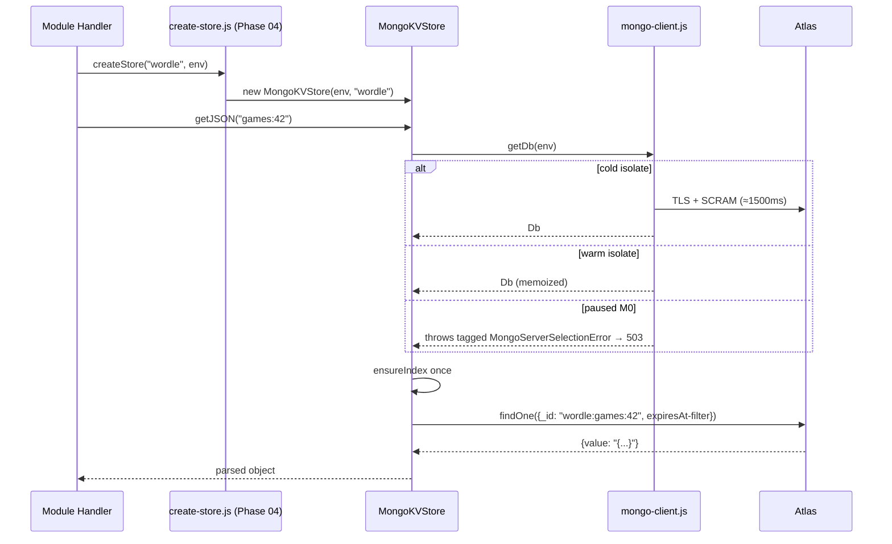

# Phase 02 — MongoKVStore Implementation

## Context Links
- [Schema report](../reports/researcher-260425-1924-mongodb-schema-and-migration.md) §2 (KV doc shape), §6 (reference impl)
- [Driver report](../reports/researcher-260425-1924-mongodb-atlas-fit-and-driver.md) §"Memoization Pattern"
- [Code-reviewer findings #6, #7, #16, #17](../reports/code-reviewer-260425-2034-atlas-plan-correctness.md)
- [Debugger GAP-C, QW-3](../reports/debugger-260425-2034-atlas-plan-failure-modes.md)
- `src/db/kv-store-interface.js` — full contract
- `src/db/cf-kv-store.js` — behavioral parity target (108 LOC)
- `src/db/create-store.js:40-78` — namespace-prefixing wrapper to mirror
- `src/bot.js` `getBot()` — memoization pattern to follow

## Overview
- **Priority:** P0
- **Status:** pending
- **Description:** Implement `MongoKVStore` (KVStore interface) + `mongo-client.js` shared connection helper. No factory wiring yet — that lands in Phase 04.

## Key Insights
- Store value as **string** (matches `putJSON` serialization). No double-parse risk; preserves null/array/nested fidelity.
- Per-module collections (12 KV modules → 12 collections), name == module name with `-` → `_` (e.g. `loldle-emoji` → `loldle_emoji`). (Reviewer #3 recommended single shared collection; user opted to keep per-module.)
- TTL index `{ expiresAt: 1 }` with `expireAfterSeconds: 0`, `sparse: true`. Sweeper runs every 60s — stale-read window vs CFKVStore documented + filtered at read time (code-reviewer #7).
- Cursor pagination via sorted `_id`, NOT `skip()`. Encode last `_id` as base64.
- Memoize `MongoClient` at module scope. **Do NOT** await `connect()` lazily inside every method — first caller awaits, others race the same promise. **On reject, null BOTH `client` and `connectPromise`** (code-reviewer #16) so the next request retries cleanly instead of reusing a dead client.
- **`list()` prefix-strip behavior** (code-reviewer #6): MongoKVStore returns keys **WITH prefix preserved** (mirrors CFKVStore). The wrapper in `create-store.js:65` strips. Unambiguous.
- **`MongoServerSelectionError`** caught in `getDb()` returning a 503-with-Retry-After path (debugger GAP-C / QW-3) — handles paused-M0 wake without a 5s hang propagating to user.

## Requirements

### Functional
- `MongoKVStore` implements every method in `kv-store-interface.js`: `get`, `put`, `delete`, `list`, `getJSON`, `putJSON`.
- Exact behavioral parity with `CFKVStore` (with TTL stale-window divergence noted):
  - `get` returns `null` on missing key (NOT `undefined`).
  - `get` and `getJSON` filter on `expiresAt` at read time (per code-reviewer #7):
    `findOne({_id, $or: [{expiresAt: {$exists: false}}, {expiresAt: {$gt: new Date()}}]})`.
    Closes the up-to-60s TTL-sweeper stale-read gap.
  - `put` with `expirationTtl` writes `expiresAt = now + ttl*1000`. Without it, removes any existing `expiresAt`.
  - `delete` is idempotent (no-op on missing key).
  - `list` returns `{ keys, cursor, done }` with `done=true` when no more pages. **Keys returned WITH prefix preserved** (parity with CFKVStore — wrapper strips).
  - `getJSON` returns `null` on missing OR malformed JSON; logs `console.warn`. Never throws.
  - `putJSON` throws on `undefined` or cyclic value.
- TTL index created idempotently on first connect per collection.
- `getDb(env)` catches `MongoServerSelectionError` and rethrows a tagged error so callers can map to 503 + Retry-After.

### Non-functional
- File ≤200 LOC. Split into:
  - `src/db/mongo-client.js` — singleton client + `getDb(env)` (≤80 LOC).
  - `src/db/mongo-kv-store.js` — class itself (≤200 LOC; if approaching limit, extract `mongo-list-cursor.js`).
- JSDoc on every export.
- No `process.env`; only `env.MONGODB_URI`.

## Architecture



### Document shape
```js
// collection: wordle (per-module)
{ _id: "wordle:games:42", value: "{\"word\":\"apple\"}", expiresAt: ISODate?  }
```

**Prefix:** the namespace prefix (`wordle:`) is preserved inside `_id` AND in the keys returned by `list()`. The wrapper in `create-store.js:65` strips on the way out (parity with CFKVStore). MongoKVStore does **not** strip prefixes — it stores and returns keys verbatim. Regression test: 2-level prefix (`wordle:games:`) round-trips through wrapper → stripped to `games:`.

### Connection memoization (with reject-handling)
```js
// mongo-client.js — sketch (NOT for copy-paste; phase-02 step writes the real version)
let client = null;
let connectPromise = null;

export async function getDb(env) {
  if (client) return client.db("miti99bot");
  if (!connectPromise) {
    client = new MongoClient(env.MONGODB_URI, {
      maxPoolSize: 1,
      minPoolSize: 0,
      serverSelectionTimeoutMS: 5000,
      connectTimeoutMS: 10000,
    });
    // Reject path: null BOTH so next call retries cleanly (code-reviewer #16)
    connectPromise = client.connect().catch((err) => {
      client = null;
      connectPromise = null;
      throw err;
    });
  }
  try {
    await connectPromise;
  } catch (err) {
    // M0 may be auto-paused; surface actionable log (debugger QW-3)
    if (err?.name === "MongoServerSelectionError") {
      console.warn(JSON.stringify({ event: "mongo_server_selection_failed", note: "M0 may be paused; caller should map to 503" }));
    }
    throw err;
  }
  return client.db("miti99bot");
}
```

## Related Code Files

### CREATE
- `/config/workspace/tiennm99/miti99bot/src/db/mongo-client.js`
- `/config/workspace/tiennm99/miti99bot/src/db/mongo-kv-store.js`
- `/config/workspace/tiennm99/miti99bot/tests/fakes/fake-mongo.js` — surface re-derived from phase-03 + phase-02 (code-reviewer #17): `findOne`, `updateOne` (upsert + `$set` + `$unset`), `deleteOne`, `find()` returning chainable `.sort().skip().limit().project().toArray()`, `insertOne`, `insertMany`, `distinct`, `deleteMany`, `countDocuments`, `createIndex` (no-op).
- `/config/workspace/tiennm99/miti99bot/tests/db/mongo-kv-store.test.js`

### MODIFY
- (none in this phase — wiring deferred to Phase 04)

### DELETE
- (none)

## Implementation Steps
1. Create `tests/fakes/fake-mongo.js` first — defines the surface area MongoKVStore + MongoTradesStore (phase-03) must use. Methods (re-derived per code-reviewer #17): `collection(name)` returns object with `findOne`, `updateOne` (with upsert + `$set` + `$unset`), `deleteOne`, `find(query)` returning chainable `.sort().skip().limit().project().toArray()`, `insertOne`, `insertMany`, `distinct`, `deleteMany`, `createIndex` (no-op), `countDocuments`. Backed by `Map<collectionName, Map<_id, doc>>`. TTL is NOT simulated (TTL is server-side; tests check `expiresAt` field only — and the read-time `expiresAt` filter is exercised against `Date.now()`).
2. Create `src/db/mongo-client.js`:
   - `getDb(env)` — module-scope memoized client + connect promise. **On `client.connect()` reject, null both** (code-reviewer #16).
   - Catch + log `MongoServerSelectionError` with actionable message (debugger QW-3).
   - `closeMongo()` — for tests/teardown only.
   - JSDoc on both.
3. Create `src/db/mongo-kv-store.js`:
   - Constructor `(env, collectionName)` — defer connect.
   - `_ensureIndex()` — runs once per collection per isolate (use a `Set<string>` at module scope).
   - Methods mirror `cf-kv-store.js` line-for-line (same null semantics, same warn-on-corrupt-JSON), **except**: `get` and `getJSON` filter on `expiresAt` at read time.
   - `list()` uses `escapeRegex` + `sort({_id:1})` + `limit(N+1)` + base64 cursor of last `_id`. Returns keys WITH prefix.
4. Write `tests/db/mongo-kv-store.test.js`:
   - Inject `fake-mongo` via dependency injection (constructor takes optional `dbOverride` for tests).
   - Cover: get-missing → null, put → get round trip, putJSON → getJSON round trip, getJSON of corrupt → null + warn, put with TTL writes `expiresAt`, put without TTL clears `expiresAt`, delete idempotent, list with prefix returns keys WITH prefix preserved, **2-level prefix regression** (`wordle:games:`), list with cursor, list `done` flag.
   - **TTL stale-read regression** (code-reviewer #7): put with `expirationTtl: 1` second, advance time 2s (mock `Date.now()` or use a tiny real sleep), assert `get` returns null even before TTL sweeper would run.
   - **Connection-reject retry regression** (code-reviewer #16): mock first `connect()` to reject; assert second `getDb()` call retries (does not reuse dead client).
   - Cover edge: `putJSON(undefined)` throws, `putJSON(circular)` throws.
5. `npm test -- mongo-kv-store` → passes.
6. `npm run lint` → passes.

## Todo List
- [ ] `tests/fakes/fake-mongo.js` created with full surface (re-derived from phase-02 + phase-03)
- [ ] `src/db/mongo-client.js` created (≤80 LOC, JSDoc, reject-resets-state, MongoServerSelectionError logged)
- [ ] `src/db/mongo-kv-store.js` created (≤200 LOC, JSDoc)
- [ ] `tests/db/mongo-kv-store.test.js` created
- [ ] All KVStore methods covered with parity tests vs CFKVStore semantics
- [ ] `expiresAt` read-time filter tested (TTL stale-read regression)
- [ ] Connect-reject retry regression tested
- [ ] 2-level prefix list regression tested
- [ ] `list()` cursor pagination tested with > 1 page; keys returned WITH prefix
- [ ] `getJSON` corrupt-data path returns null without throwing
- [ ] `npm test` passes
- [ ] `npm run lint` passes
- [ ] No file > 200 LOC

## Success Criteria
- All tests in `mongo-kv-store.test.js` pass.
- Behavioral diff vs `cf-kv-store.js` is zero for the 6 KVStore methods (verified by symmetric test cases) **except** the documented TTL stale-read divergence (which the read-time filter eliminates).
- `mongo-client.js` connect-promise is awaited exactly once per isolate under concurrent first calls; on reject, both `client` and `connectPromise` are nulled.

## Risk Assessment

| Risk | Likelihood | Impact | Mitigation |
|------|-----------|--------|------------|
| `JSON.parse` throws despite warn-and-null contract | L | M | Wrap in try/catch identical to `cf-kv-store.js:85-91`. |
| TTL stale-read window divergence vs CFKVStore | M | L | Read-time `expiresAt` filter (code-reviewer #7); tested via 1s-TTL + 2s-sleep regression. **Functional & risk sections both call out this divergence explicitly.** |
| Memoized client lingers across hot-reloads in `wrangler dev` | M | L | `closeMongo()` exposed for test teardown; in prod, isolate teardown handles it. |
| Concurrent `_ensureIndex` calls race | L | L | Idempotent on Mongo side. Track per-collection in module-scope `Set` to skip extra round-trips. |
| Driver throws on absent `expiresAt` field with sparse index | L | M | Verified by report §2 (sparse:true). Test covers no-TTL case. |
| Dead-client reuse after `connect()` rejection | M | H | Reject handler nulls both; regression tested (code-reviewer #16). |
| Paused M0 cluster causes hang | M | H | `serverSelectionTimeoutMS: 5000` + caught + logged + caller maps to 503 (debugger GAP-C). |
| `list()` cursor encodes `_id` containing colon → base64 fine | L | L | Already opaque per interface contract; no consumer parses cursor. |

## Security Considerations
- Connection only via `env.MONGODB_URI` — never accept URI from request input.
- `MongoClient` constructor must NOT log URI on failure. Wrap in try/catch with redacted message.
- Reads/writes never echo full document into logs (PII risk: trading user_id).
- Test fakes never make network calls.

## Rollback (this phase only)
1. Delete created files.
2. `npm uninstall mongodb` (if not needed by Phase 03 yet — but it will be).
3. No runtime impact: nothing in Phase 02 is wired into the request path yet.

## Next Steps
- **Blocks:** Phase 04 (dual-write wraps this).
- **Unblocks:** Phase 03 can proceed in parallel (independent file).
