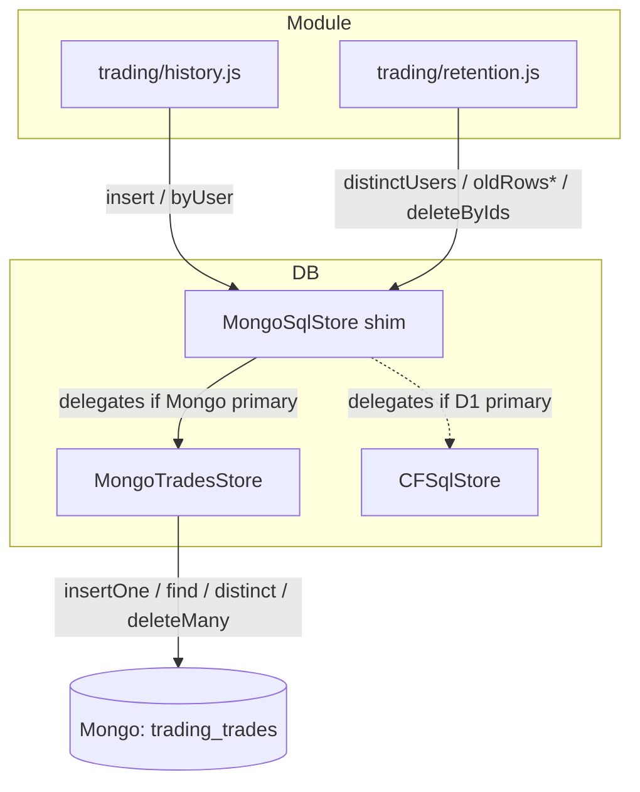

# Phase 03 — MongoTradesStore + Trading Refactor

## Context Links
- [Schema report](../reports/researcher-260425-1924-mongodb-schema-and-migration.md) §3 (trading mapping), §6 (reference impl)
- [Brainstormer Findings #2, #6, #7](../reports/brainstormer-260425-2034-atlas-plan-critique.md)
- [Code-reviewer Findings #1, #3, #13](../reports/code-reviewer-260425-2034-atlas-plan-correctness.md)
- [Debugger #17](../reports/debugger-260425-2034-atlas-plan-failure-modes.md)
- `src/db/sql-store-interface.js` — full contract (kept; `MongoSqlStore` is a thin shim)
- `src/db/cf-sql-store.js` — behavioral parity target (80 LOC)
- `src/modules/trading/history.js`, `src/modules/trading/retention.js` — direct refactor targets
- `src/modules/trading/migrations/0001_trades.sql`
- `tests/db/create-sql-store.test.js:48-52` — pre-existing assertion that `last_row_id` is present (constrains return shape)

## Overview
- **Priority:** P0
- **Status:** pending
- **Description:** Replace the SQL-pattern dispatcher approach with a direct **`MongoTradesStore`** (~80 LOC, 6 explicit methods). Refactor `trading/history.js` + `trading/retention.js` to call it directly. Keep `MongoSqlStore` as a thin shim (returns `MongoTradesStore` for the trading module) so `create-sql-store.js` factory branching is unchanged and `tests/db/create-sql-store.test.js` continues to pass.

## Key Insights
- Trading uses 6 distinct queries today (history.js + retention.js). The dispatcher approach (regex-match SQL strings) is brittle: statements 4 & 5 cannot be distinguished by first-30-char prefix (code-reviewer #3); a future 7th statement silently breaks.
- **Direct refactor is simpler AND safer** (brainstormer #6): explicit methods make the persistence boundary honest. The trading module already isolates SQL strings to two small files (~30 LOC of changes total).
- **Preserve `legacy_id`** (code-reviewer #13 / debugger #17): backfill writes `{_id: ObjectId, legacy_id: <orig_int>, user_id, ...}`. Historical trade IDs in logs/dashboards stay joinable.
- **`last_row_id` contract** (code-reviewer #1): existing test `tests/db/create-sql-store.test.js:48-52` asserts `result.last_row_id` is present. `MongoSqlStore.run` returns `{changes: 1, last_row_id: 0}` for inserts (number, NOT hex). Trading code does NOT consume `last_row_id` (verified in step 1) — `0` is safe.
- **Confirm zero arithmetic on `id`** (debugger #17): `grep -r "\.id\s*[-+*/<>]" src/modules/trading/` must return empty. If any match, escalate before refactor.

## Requirements

### Functional
- `src/db/mongo-trades-store.js` (~80 LOC). 6 explicit methods:
  - `insert(trade)` → `db.trading_trades.insertOne({_id: ObjectId(), legacy_id: null, ...trade})` returns `{changes: 1, last_row_id: 0}`.
  - `byUser(userId, limit)` → `find({user_id: userId}).sort({ts:-1}).limit(limit).toArray()` → adapt each doc.
  - `distinctUsers()` → `distinct("user_id")`.
  - `oldRowsForUser(userId, keepN)` → `find({user_id: userId}).sort({ts:-1}).skip(keepN).project({_id:1}).toArray()` → ids.
  - `oldRows(keepN)` → `find({}).sort({ts:-1}).skip(keepN).project({_id:1}).toArray()` → ids.
  - `deleteByIds(ids)` → `deleteMany({_id: {$in: ids.map(toObjectIdOrLegacy)}})`.
- `src/db/mongo-sql-store.js` (~40 LOC) is a **thin shim** that satisfies the `SqlStore` interface for `create-sql-store.js` factory branching:
  - For trading module, returns a wrapper exposing `run`/`all`/`first`/`prepare`/`batch` that delegates to `MongoTradesStore`. `prepare`/`batch` throw `"unsupported"`.
  - `run` returns `{changes: 1, last_row_id: 0}` for inserts. `0` is a number — satisfies `tests/db/create-sql-store.test.js:48-52`.
  - `tablePrefix` exposed (matches `create-sql-store.js:39-42`).
- Refactor `src/modules/trading/history.js`: replace SQL-string `.run()` / `.all()` / `.first()` calls with `MongoTradesStore.insert` / `.byUser`. (~15 LOC delta.)
- Refactor `src/modules/trading/retention.js`: replace SQL-string calls with `.distinctUsers` / `.oldRowsForUser` / `.oldRows` / `.deleteByIds`. (~15 LOC delta.)
- During dual-write window the SqlStore interface still delegates to D1 for primary OR Mongo for primary (Phase 04 wraps both). `MongoTradesStore` is the Mongo-side concrete; `CFSqlStore` is the D1-side concrete.

### Non-functional
- `src/db/mongo-trades-store.js` ≤100 LOC.
- `src/db/mongo-sql-store.js` ≤80 LOC (thin shim only).
- JSDoc on every export.
- No SQL strings anywhere in `src/db/mongo-*.js`.
- Trading module changes: ~30 LOC total across 2 files.

## Architecture



### Document shape (collection: `trading_trades`)
```js
{
  _id: ObjectId,
  legacy_id: number | null,    // D1 autoincrement id, preserved during backfill (code-reviewer #13)
  user_id: number,
  symbol: string,
  side: "buy" | "sell",
  qty: number,
  price_vnd: number,
  ts: number   // ms timestamp, parity with D1 column
}
```

### Indexes
```js
db.trading_trades.createIndex({ user_id: 1, ts: -1 });
db.trading_trades.createIndex({ ts: -1 });
db.trading_trades.createIndex({ legacy_id: 1 }, { sparse: true });   // for legacy joins
```

### Why direct refactor over dispatcher
| Concern | Dispatcher | Direct |
|---------|-----------|--------|
| 7th SQL statement | Silent breakage (M likelihood per dispatcher's own risk row) | Cannot happen — explicit method per use-case |
| Statements 4 vs 5 disambiguation | Requires inspecting beyond first 30 chars (code-reviewer #3) | N/A — different methods |
| `LIMIT -1 OFFSET ?` sqlite-ism | Handler must ignore LIMIT silently | N/A — `oldRowsForUser/oldRows` use `.skip()` only |
| Test surface | Pattern-match coverage of every variation | One test per method |
| LOC | ~150 dispatcher + ~200 handlers | ~80 store + ~30 module changes |

## Related Code Files

### CREATE
- `/config/workspace/tiennm99/miti99bot/src/db/mongo-trades-store.js`
- `/config/workspace/tiennm99/miti99bot/src/db/mongo-sql-store.js` (thin shim, ≤80 LOC)
- `/config/workspace/tiennm99/miti99bot/tests/db/mongo-trades-store.test.js`
- `/config/workspace/tiennm99/miti99bot/tests/db/mongo-sql-store.test.js` (covers shim run/all/first contract — `last_row_id: 0` for inserts)

### MODIFY
- `/config/workspace/tiennm99/miti99bot/src/modules/trading/history.js` — replace SQL strings with `MongoTradesStore` method calls.
- `/config/workspace/tiennm99/miti99bot/src/modules/trading/retention.js` — same.
- `/config/workspace/tiennm99/miti99bot/tests/modules/trading/*.test.js` — update where SQL strings appear; switch to `MongoTradesStore` mocks.

### READ FOR CONTEXT (do not edit)
- `/config/workspace/tiennm99/miti99bot/src/db/sql-store-interface.js`
- `/config/workspace/tiennm99/miti99bot/src/db/cf-sql-store.js`
- `/config/workspace/tiennm99/miti99bot/src/modules/trading/migrations/0001_trades.sql`
- `/config/workspace/tiennm99/miti99bot/tests/db/create-sql-store.test.js:48-52` — `last_row_id` shape constraint

### DELETE
- (none — D1 binding stays through Phase 07)

## Implementation Steps
1. Grep `src/modules/trading/` for every `.run(`, `.all(`, `.first(`, `.prepare(`, `.batch(` call. Confirm only the 6 known queries. If a 7th appears, list before proceeding (refactor must include it).
2. **Verify zero arithmetic on `id`** (debugger #17): `grep -r "\.id\s*[-+*/<>]" src/modules/trading/`. Must return empty. Document the grep result inline in the phase plan.
3. Confirm `last_row_id` is unused by trading: `grep -r "last_row_id" src/modules/trading/` — must return empty (only `cf-sql-store.js` and tests reference it).
4. Create `src/db/mongo-trades-store.js`:
   - Constructor `(env)` — defers connect.
   - 6 methods listed above; each ≤15 LOC.
   - `_ensureIndexes()` lazy init (3 indexes).
   - JSDoc.
5. Create `src/db/mongo-sql-store.js` thin shim:
   - Constructor `(env, moduleName)`.
   - `tablePrefix = ${moduleName}_`.
   - `run/all/first` delegate to a `MongoTradesStore` instance for trading module by introspecting query for hard-coded markers (or — simpler — accept a method-name in module init). **Decision:** the shim wraps `MongoTradesStore` and only the trading module ever instantiates it; the shim's `run/all/first` exist purely for `SqlStore` interface compliance + the existing factory-test contract. The trading module DOES NOT call the shim — it imports `MongoTradesStore` directly. Shim's `run/all/first` translate the 6 known queries OR throw `"MongoSqlStore: unsupported query — call MongoTradesStore directly"` for everything else.
   - **Insert returns `{changes: 1, last_row_id: 0}` (number, not hex)** per code-reviewer #1.
   - `prepare`/`batch` throw `"unsupported in MongoSqlStore"`.
6. Refactor `src/modules/trading/history.js`:
   - Replace SQL-string `.run(...)` with `tradesStore.insert({...})`.
   - Replace SQL-string `.all(...)` for history with `tradesStore.byUser(userId, limit)`.
   - Module init signature change: `init({ db, sql, tradesStore, env })` — Phase 04 factory passes the right `tradesStore` (Mongo or null when D1-primary). When Mongo unavailable + D1 primary, fall back to old SQL path through `sql`.
7. Refactor `src/modules/trading/retention.js`:
   - Replace SQL-string `.all(...)` for distinct → `tradesStore.distinctUsers()`.
   - Replace per-user retention SELECT → `tradesStore.oldRowsForUser(userId, keepN)`.
   - Replace global retention SELECT → `tradesStore.oldRows(keepN)`.
   - Replace DELETE IN (...) → `tradesStore.deleteByIds(ids)`.
8. Write `tests/db/mongo-trades-store.test.js`:
   - Inject `fake-mongo` via constructor.
   - One test per method; cover edge cases (empty list, IDs with `legacy_id` mix, ordering).
9. Write `tests/db/mongo-sql-store.test.js`:
   - Verify `run` returns `{changes, last_row_id: 0}` (number) — satisfies `tests/db/create-sql-store.test.js:48-52`.
   - Verify `prepare`/`batch` throw.
10. Update `tests/modules/trading/*.test.js` to use `MongoTradesStore` mock + injected `tradesStore`.
11. `npm test` passes (including `tests/db/create-sql-store.test.js`). `npm run lint` passes.

## Todo List
- [ ] Grep confirms exactly 6 SQL statements in trading module (or extends list)
- [ ] **Grep confirms zero arithmetic on `id`** (debugger #17)
- [ ] `last_row_id` confirmed unused by trading
- [ ] `src/db/mongo-trades-store.js` created (≤100 LOC, 6 methods, JSDoc)
- [ ] `src/db/mongo-sql-store.js` shim created (≤80 LOC, returns `last_row_id: 0`)
- [ ] `trading/history.js` refactored to use `MongoTradesStore` directly
- [ ] `trading/retention.js` refactored
- [ ] Trading module init signature accepts `tradesStore`
- [ ] `legacy_id` field shape documented + index created
- [ ] `tests/db/mongo-trades-store.test.js` covers all 6 methods
- [ ] `tests/db/mongo-sql-store.test.js` covers shim contract incl. `last_row_id: 0`
- [ ] Trading module tests updated
- [ ] `tests/db/create-sql-store.test.js:48-52` still passes (no contract regression)
- [ ] `npm test` passes
- [ ] `npm run lint` passes

## Success Criteria
- `MongoTradesStore` provides exact behavioral parity with the 6 D1 queries (verified per-method).
- Trading module no longer contains SQL string literals.
- `MongoSqlStore` shim satisfies `SqlStore` interface for factory branching.
- `last_row_id: 0` (number) — `tests/db/create-sql-store.test.js:48-52` unchanged and passing.
- `legacy_id` preserved on backfilled trades.

## Risk Assessment

| Risk | Likelihood | Impact | Mitigation |
|------|-----------|--------|------------|
| 7th SQL statement appears mid-refactor | L | M | Step 1 grep gates the refactor. Direct method approach makes additions explicit; cannot silently break. |
| `id` arithmetic somewhere unseen | L | H | Step 2 grep gate; if found, escalate. |
| `last_row_id: 0` consumer somewhere | L | M | Step 3 grep gate; trading confirmed not to consume. |
| Trading test regressions on signature change | M | M | Step 10 updates tests in same commit. Run `npm test` between steps. |
| `legacy_id` lookups slow without index | L | L | Sparse index on `legacy_id` created (step 4 lazy init). |
| Backwards-compat for in-flight D1 reads during dual-write | L | M | Phase 04 factory selects which concrete (Mongo or D1) per primary flag. Module sees uniform interface. |

## Security Considerations
- Bind values pass through unmodified; no string concatenation into queries.
- `_id` exposed as hex; not sensitive (server-generated).
- No SQL strings anywhere in trading code post-refactor — eliminates an entire class of injection foot-gun.

## Rollback (this phase only)
1. Revert `src/modules/trading/*.js` changes (single commit).
2. Delete `src/db/mongo-trades-store.js` + `src/db/mongo-sql-store.js`.
3. No runtime impact (not wired in yet).

## Next Steps
- **Blocks:** Phase 04 (dual-write SQL wrapper needs the shim + concrete).
- **Parallel-safe with:** Phase 02 (independent files; both feed into Phase 04).
