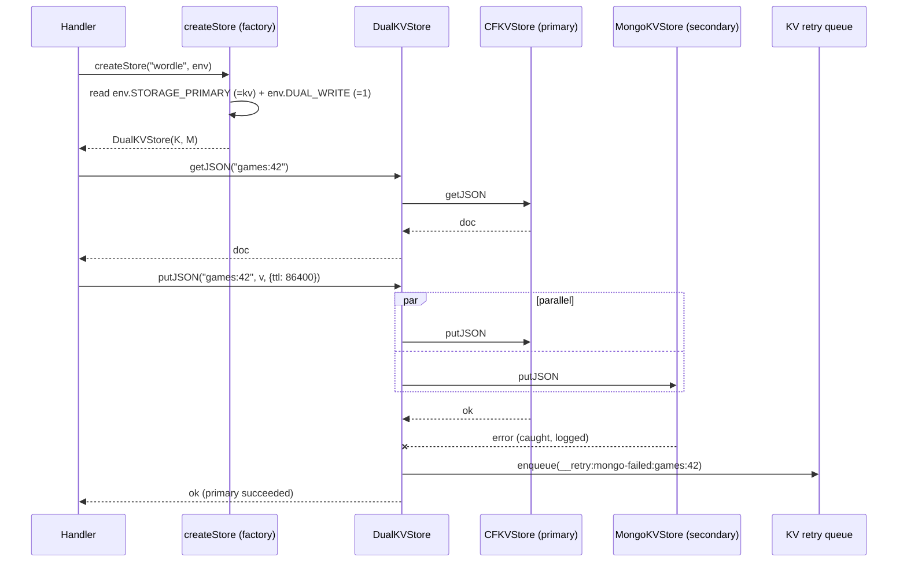
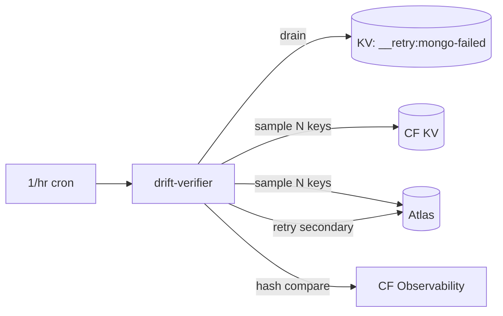

# Phase 04 — Dual-Write Wrappers + Storage Flag + e2e

## Context Links
- [Schema report](../reports/researcher-260425-1924-mongodb-schema-and-migration.md) §5 (dual-write mechanics)
- [Code-reviewer Findings #2, #8, #18, #20, #27](../reports/code-reviewer-260425-2034-atlas-plan-correctness.md)
- [Brainstormer Finding #10](../reports/brainstormer-260425-2034-atlas-plan-critique.md) (e2e moves earlier)
- [Debugger #8](../reports/debugger-260425-2034-atlas-plan-failure-modes.md)
- `src/db/create-store.js` — KV factory to extend (≤80 LOC currently)
- `src/db/create-sql-store.js` — SQL factory to extend (≤80 LOC currently)
- `scripts/stub-kv.js` — needs sibling `stubMongo` (duck-typed, NOT a string)
- `scripts/register.js:75` — `buildRegistry({MODULES, KV: stubKv, AI: stubAi})` call site

## Overview
- **Priority:** P0
- **Status:** pending
- **Description:** Wrap KV and SQL stores so writes hit BOTH backends and reads hit the configured primary. Single env flag `STORAGE_PRIMARY` toggles read source. **Also lands the e2e storage-roundtrip test** (moved here from phase-08 per brainstormer #10) so dual-write code is end-to-end-tested before any prod soak. This is the ONLY phase that touches the request path's data layer pre-cutover.

## Key Insights
- Single source of truth: `env.STORAGE_PRIMARY` ∈ {`kv`, `mongo`}. Default `kv`.
- Dual-write is **always on** when MongoDB credentials are present, regardless of `STORAGE_PRIMARY`. Goal: keep secondary warm + ready for read-flip.
- Writes to BOTH must be parallel via `Promise.allSettled`. If secondary write fails → log error AND push the failed key onto a small KV retry queue (`__retry:mongo-failed`) for later drain. Throw only on primary failure. (code-reviewer #8 / debugger #8)
- A separate **drift-verifier cron** (1/hr or 1/6h, sample N keys) drains the retry queue + spot-checks parity. Replaces the original "one-shot reconciliation" approach.
- During cutover (Phase 07), the flag flips to `mongo`. After soak, secondary writes can be turned off via a second flag `DUAL_WRITE` (default `1`, set to `0` post-cutover).
- `register.js` runs at deploy time — does NOT need a Mongo connection. Pass **duck-typed `stubMongo`** + `STUB_SENTINEL` so factories short-circuit even if flags drift (code-reviewer #2).

## Requirements

### Functional
- `DualKVStore` class implementing `KVStore` interface:
  - `get`/`getJSON`/`list` → read from primary only.
  - `put`/`putJSON`/`delete` → write to both via `Promise.allSettled`. Log secondary failures with key + error AND enqueue to `__retry:mongo-failed` (a KV list bound to the same `env.KV` namespace, prefix `__retry:mongo-failed:`). Throw only on primary failure.
  - Expose `_kind === "dual"` sentinel for test-side identification (replaces the `_implementations` array seam — code-reviewer #27).
- `DualSqlStore` class implementing `SqlStore` interface:
  - `all`/`first` → read primary only.
  - `run` → write both. Same fault tolerance as KV (retry-queue same namespace, prefix `__retry:mongo-sql-failed:`).
  - `prepare`/`batch` → primary only (D1 stays authoritative for legacy paths until cutover).
- `create-store.js` factory updated:
  - Reads `env.STORAGE_PRIMARY` (default `"kv"`) and `env.DUAL_WRITE` (default `"1"`).
  - **If `env.MONGODB_URI === STUB_SENTINEL`** → unconditionally return CFKVStore-only (deploy-time path).
  - If `MONGODB_URI` absent → return CFKVStore-only (legacy path).
  - If `DUAL_WRITE=0` AND `STORAGE_PRIMARY=mongo` → return MongoKVStore-only.
  - Otherwise → return `DualKVStore(primary, secondary)`.
  - **Pre-design post-cutover shape** (code-reviewer #20): when both flags are absent / unset, factory returns MongoKVStore-only directly (no flag inspection). Phase-07 simplification just deletes the KV branches.
- `create-sql-store.js` factory mirrors logic for SQL (uses `MongoSqlStore` shim from phase-03).
- `register.js` + `scripts/stub-kv.js`: add **duck-typed** `stubMongo` (NOT a string) + `STUB_SENTINEL` so deploy-time registry build doesn't crash.
- **Drift-verifier cron** (replaces one-shot phase-05 reconciliation):
  - New module `src/cron/drift-verifier.js` (or co-located in misc) registered in `wrangler.toml [triggers] crons` at 1/hr (configurable).
  - Drains `__retry:mongo-failed` queue (each entry: re-attempt the secondary write).
  - Spot-checks parity: sample N keys per module, hash-compare values, log mismatches.
- **e2e test** lands HERE (not phase-08 — brainstormer #10): `tests/e2e/storage-roundtrip.test.js` boots a fake env with `MongoKVStore` + `MongoSqlStore` against `fake-mongo.js`, dispatches a representative wordle command + a trading insert, asserts state persisted.

### Non-functional
- Each new file ≤200 LOC.
- New files: `src/db/dual-kv-store.js`, `src/db/dual-sql-store.js`, `src/cron/drift-verifier.js`, `tests/e2e/storage-roundtrip.test.js`.
- All new exports JSDoc'd.
- Behavior must be deterministic given env flags (testable via fake env).
- Logging via `console.warn`/`console.error` with structured fields (`{ phase, op, key, err }`).

## Architecture

### Read/write flow (during dual-write window)


### Drift-verifier cron flow


### Flag matrix

| `STORAGE_PRIMARY` | `DUAL_WRITE` | `MONGODB_URI` | Result |
|--------------------|--------------|----------------|--------|
| (unset) or `kv` | `1` (default) | set | DualKV: read KV, write both |
| (unset) or `kv` | `0` | any | CFKVStore only (legacy / rollback) |
| `mongo` | `1` | set | DualKV: read Mongo, write both (cutover phase) |
| `mongo` | `0` | set | MongoKVStore only (post-cutover) |
| any | any | unset | CFKVStore only (Phase 02/03 not deployed yet) |
| any | any | === STUB_SENTINEL | CFKVStore only (deploy-time register path) |

### Stub for register (duck-typed; code-reviewer #2)
```js
// scripts/stub-kv.js — sketch
export const STUB_SENTINEL = "__stub_mongo__";
export const stubMongo = {
  // duck-typed MongoClient surface that no-ops without network IO
  db() { return { collection: () => { throw new Error("stubMongo: no IO"); } }; },
  connect: async () => undefined,
  close: async () => undefined,
};
// register.js passes env.MONGODB_URI = STUB_SENTINEL; factories short-circuit on sentinel
```
Test: assert zero `MongoClient.connect()` calls when stub is used (`vi.spyOn(MongoClient.prototype, 'connect')`).

### Rollback semantics (code-reviewer #18)
**Rollback to KV-primary AFTER any Mongo-primary period requires reverse-backfill.** During the Mongo-primary window, secondary writes to KV may have failed silently and KV may be missing rows that exist only in Mongo. Cross-link to Phase 07 reverse-backfill scripts (which become Stage-2 prerequisites — see phase-07 step 11 prereq).

## Related Code Files

### CREATE
- `/config/workspace/tiennm99/miti99bot/src/db/dual-kv-store.js`
- `/config/workspace/tiennm99/miti99bot/src/db/dual-sql-store.js`
- `/config/workspace/tiennm99/miti99bot/src/cron/drift-verifier.js`
- `/config/workspace/tiennm99/miti99bot/tests/db/dual-kv-store.test.js`
- `/config/workspace/tiennm99/miti99bot/tests/db/dual-sql-store.test.js`
- `/config/workspace/tiennm99/miti99bot/tests/e2e/storage-roundtrip.test.js`

### MODIFY
- `/config/workspace/tiennm99/miti99bot/src/db/create-store.js` — read flags, branch, honor STUB_SENTINEL.
- `/config/workspace/tiennm99/miti99bot/src/db/create-sql-store.js` — same.
- `/config/workspace/tiennm99/miti99bot/scripts/stub-kv.js` — add `stubMongo` (duck-typed) + `STUB_SENTINEL`.
- `/config/workspace/tiennm99/miti99bot/scripts/register.js:75` — pass `MONGODB_URI: STUB_SENTINEL, STORAGE_PRIMARY: "kv", DUAL_WRITE: "0"` in env stub.
- `/config/workspace/tiennm99/miti99bot/wrangler.toml` — add `[vars] STORAGE_PRIMARY = "kv"`, `DUAL_WRITE = "1"`; add 1/hr cron for drift-verifier.

### DELETE
- (none)

## Implementation Steps
1. Grep `env.KV` and `env.DB` usage outside `src/db/` — should be zero (encapsulated). Confirm.
2. Create `src/db/dual-kv-store.js`:
   - Constructor `(primary, secondary, retryQueue, logger=console)`.
   - 6 methods. Reads → primary. Writes → `Promise.allSettled` with secondary errors logged AND enqueued to `retryQueue`.
   - Expose `_kind = "dual"` (code-reviewer #27).
   - JSDoc.
3. Create `src/db/dual-sql-store.js` — same shape, SqlStore interface.
4. Create `src/cron/drift-verifier.js`:
   - Cron handler signature `(event, ctx)`. `ctx.db / ctx.sql` provide the dual store.
   - Drain `__retry:mongo-failed` (and SQL queue) — re-attempt secondary writes; remove on success.
   - Sample N keys per module via dual store; hash-compare; log mismatches.
   - Tunable N via `env.DRIFT_SAMPLE_N` (default 50).
5. Modify `src/db/create-store.js`:
   - **Short-circuit on STUB_SENTINEL** (code-reviewer #2).
   - Branch on `env.STORAGE_PRIMARY`, `env.DUAL_WRITE`, presence of `env.MONGODB_URI`.
   - When constructing MongoKVStore, pass collection name (sanitized: replace `-` with `_`).
   - Keep the existing prefixed-wrapper closure intact.
   - **Comment the post-cutover shape** (code-reviewer #20): `// post-Phase-07: this entire function returns MongoKVStore-only; KV branches removed`.
6. Modify `src/db/create-sql-store.js` mirrored. Use `MongoSqlStore` shim from phase-03; trading module's init wires `MongoTradesStore` directly via `tradesStore` param.
7. Add `stubMongo` + `STUB_SENTINEL` to `scripts/stub-kv.js`. Update `scripts/register.js:75` to pass `MONGODB_URI: STUB_SENTINEL, STORAGE_PRIMARY: "kv", DUAL_WRITE: "0"`.
8. Update `wrangler.toml` `[vars]` block to declare `STORAGE_PRIMARY = "kv"`, `DUAL_WRITE = "1"`, `DRIFT_SAMPLE_N = "50"`. Add cron `"0 * * * *"` (or `"0 */6 * * *"` if log volume is a concern).
9. Tests:
   - `dual-kv-store.test.js`: write succeeds when both succeed; write succeeds when secondary fails (logs + enqueues retry); write fails when primary fails; reads always from primary; `_kind === "dual"`.
   - `dual-sql-store.test.js`: same pattern.
   - **stubMongo regression** (code-reviewer #2): construct factory with `STUB_SENTINEL` + every flag combo; `vi.spyOn(MongoClient.prototype, 'connect')` asserts ZERO calls.
   - Integration test: factory with all flag combos returns correct concrete type (verify via `_kind` sentinel).
   - **e2e test** `tests/e2e/storage-roundtrip.test.js`: boot fake env (`fake-mongo`), build registry, dispatch a wordle command (KV path) + trading insert (SQL path), assert persistence.
   - Update register dry-run test to confirm command list still derives.
10. Run `npm test`, `npm run lint`, `npm run register:dry`. All pass.

## Todo List
- [ ] `dual-kv-store.js` created (with retry-queue + `_kind` sentinel)
- [ ] `dual-sql-store.js` created
- [ ] `src/cron/drift-verifier.js` created + cron registered in wrangler.toml
- [ ] `create-store.js` reads env flags + honors STUB_SENTINEL + post-cutover shape commented
- [ ] `create-sql-store.js` mirrors logic
- [ ] Duck-typed `stubMongo` + `STUB_SENTINEL` added to `stub-kv.js`
- [ ] `register.js` passes Mongo stub + flags
- [ ] `wrangler.toml` declares `STORAGE_PRIMARY` + `DUAL_WRITE` + `DRIFT_SAMPLE_N` + drift cron
- [ ] All test files written, passing
- [ ] **stubMongo never reaches MongoClient.connect** asserted in test
- [ ] **e2e storage-roundtrip test** passes (wordle KV + trading SQL)
- [ ] `npm run register:dry` succeeds
- [ ] `npm test` passes
- [ ] `npm run lint` passes
- [ ] Manual smoke: `wrangler dev` with `MONGODB_URI` set + `DUAL_WRITE=1` → write to wordle module → verify both KV and Mongo received it

## Success Criteria
- All 6 flag/sentinel combos behave per matrix.
- Secondary failure does NOT fail user-facing request; failure IS logged AND enqueued to retry queue.
- `register:dry` continues to work without Mongo creds; zero MongoClient.connect calls.
- Drift-verifier cron drains retry queue + flags any divergence ≥ threshold.
- e2e roundtrip passes for both KV (wordle) and SQL (trading) paths against `fake-mongo`.

## Risk Assessment

| Risk | Likelihood | Impact | Mitigation |
|------|-----------|--------|------------|
| Secondary write silently masks data divergence | M | H | Retry queue + drift-verifier cron (1/hr). Phase 06 monitors error rate. |
| Write amplification doubles latency on every put | H | M | `Promise.allSettled` parallel; latency = max(KV, Mongo). Cold p99 = 1500ms — flagged in Phase 06 abort gate. |
| `register:dry` connects to Atlas and fails | L | H | `STUB_SENTINEL` short-circuit; regression-tested in step 9. |
| Flag drift between wrangler.toml and .env.deploy | M | M | Phase 08 docs include checklist; lint script checks both files declare `STORAGE_PRIMARY`. |
| `MONGODB_URI` missing in prod → factory falls back silently | L | H | Boot-time assertion: if `STORAGE_PRIMARY=mongo` but URI absent (and not STUB_SENTINEL), throw on first request. |
| Order-of-operations bug: read after write reads stale primary | L | M | Same-isolate writes to primary block reads (single-threaded JS); no interleaving issue. |
| Mongo write fails because collection didn't exist + index not created | L | M | MongoKVStore `_ensureIndex` creates lazily; first write triggers creation. Tested in Phase 02. |
| Drift-verifier cron itself burns M0 ops | L | L | Default 1/hr × N=50 = ~1200 reads/day, well under M0 envelope. Tunable via `DRIFT_SAMPLE_N`. |
| **Rollback to KV-primary after Mongo-primary loses data** | M | H | **Reverse-backfill scripts (phase-07) are Stage-2 prerequisites** (code-reviewer #18). Cross-linked. |

## Security Considerations
- Logged errors must NOT include the document `value` (PII risk for trading).
- Retry-queue values may contain document blobs — same redaction rules for any cron-driven log emission.
- `STORAGE_PRIMARY` and `DUAL_WRITE` are public-readable env vars (in `wrangler.toml`). Acceptable — they're routing flags, not secrets.
- `STUB_SENTINEL` is a public string; safe — not a credential.

## Rollback (this phase only)
1. Set `DUAL_WRITE=0` in wrangler.toml `[vars]`. Redeploy.
2. CFKVStore + CFSqlStore become sole path. Identical to pre-Phase-04 behavior.
3. Disable drift-verifier cron (remove from wrangler.toml triggers).
4. (Optional) Revert phase commits if rollback is permanent.

## Next Steps
- **Blocks:** Phase 05 (backfill must run with dual-write live so concurrent writes don't bypass Mongo).
- **Unblocks:** Phase 05.
