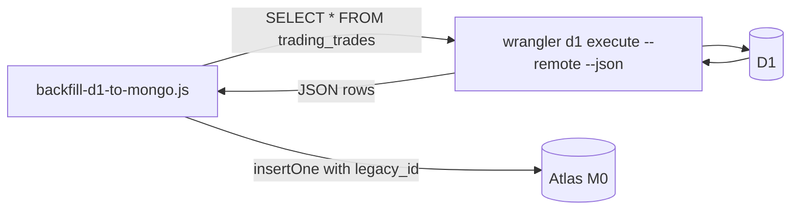

# Phase 05 — Backfill + Verification (Local-Only, No Admin Routes)

## Context Links
- [Schema report](../reports/researcher-260425-1924-mongodb-schema-and-migration.md) §5 Phase 3+4 (backfill, verify)
- [Brainstormer Finding #5](../reports/brainstormer-260425-2034-atlas-plan-critique.md) (no admin routes)
- [Code-reviewer #4, #21](../reports/code-reviewer-260425-2034-atlas-plan-correctness.md)
- [Debugger #16, #10](../reports/debugger-260425-2034-atlas-plan-failure-modes.md)
- `docs/architecture.md` § 10 — explicitly rejects admin HTTP surface; this phase complies.
- `scripts/migrate.js` — D1 migration runner pattern (Node script using wrangler envs)
- `wrangler.toml:14-22` — KV + D1 binding IDs
- 12 KV-using modules: util, wordle, loldle, loldle-emoji, loldle-quote, loldle-ability, loldle-splash, misc, lolschedule, semantle, doantu, twentyq
- 1 D1-using module: trading

## Overview
- **Priority:** P0
- **Status:** pending
- **Description:** One-shot **local-node** scripts to copy historical KV → Mongo, D1 → `trading_trades`. Plus a verifier comparing counts + sample-value hashes. Run AFTER Phase 04 dual-write is live so concurrent writes are already going to Mongo. **No admin HTTP routes** — uses CF KV REST API + `wrangler d1 export` per `docs/architecture.md` § 10 (brainstormer #5).

## Key Insights
- **Order matters**: dual-write must be deployed BEFORE backfill. Otherwise: writes during backfill window go to KV only → backfill misses them OR overwrites newer Mongo state.
- **No admin HTTP surface** (architectural compliance per `docs/architecture.md` § 10):
  - KV reads via CF KV REST API: `https://api.cloudflare.com/client/v4/accounts/{id}/storage/kv/namespaces/{nsid}/keys` (paginated) + `/values/{key}` per key. Account token (already standard for `wrangler kv` ops).
  - D1 reads via `npx wrangler d1 export miti99bot-db --remote --output=trades.sql` (already used in phase-07; mirror here).
  - Mongo writes via local node + `mongodb` SDK (no Worker constraints).
  - Backfill scripts run from operator's local machine; no `ADMIN_TOKEN` secret introduced.
- KV `list()` REST endpoint paginated 1000/page. Each value via `/values/{key}` GET. Expect minutes for full sweep across 12 modules. **Metadata** (`expirationTtl`) included on list response — propagate to `expiresAt` on Mongo upsert (debugger #10).
- D1 `trading_trades` is small (<300KB / few thousand rows). Single export + insertMany ok.
- Mongo Atlas M0 throughput ~100 ops/sec. Budget backfill at 50 ops/sec to leave headroom for live traffic. `await sleep(20)` between writes.
- **Upsert semantics**: `updateOne({_id}, {$setOnInsert: {...}, $set: {value, expiresAt}}, {upsert: true})` — skip-if-exists for new docs, but ensure `expiresAt` reflects source TTL.
- **Verifier sample size** (code-reviewer #21): `N = √(total) capped at 500`; full-scan compare on collections <10K docs (cheap on M0 with small data).
- **Cursor checkpoint** (debugger #16): write last-processed key to `.backfill-cursor-{module}.json` per module so a CPU-budget OOM doesn't lose progress.

## Requirements

### Functional
- `scripts/backfill-kv-to-mongo.js`:
  - Local node script using CF KV REST API + `mongodb` SDK directly.
  - Reads `CLOUDFLARE_ACCOUNT_ID`, `CLOUDFLARE_API_TOKEN`, `KV_NAMESPACE_ID`, `MONGODB_URI` from `.env.deploy` (mirror of existing `wrangler kv` cred usage).
  - For each module in `MODULES`: paginated KV list → for each key → if Mongo doc absent, copy with **`expiresAt` propagated from KV `metadata.expirationTtl`** (debugger #10).
  - **Cursor checkpoint** to `.backfill-cursor-{module}.json` after each REST page; resume on restart (debugger #16).
  - Logs progress per module: `[wordle] 142 keys: 138 copied, 4 skipped (already in Mongo)`.
  - Idempotent: re-running is safe (skip-if-exists).
- `scripts/backfill-d1-to-mongo.js`:
  - Local node script.
  - Step 1: `npx wrangler d1 export miti99bot-db --remote --output=./.backfill/trades.sql`.
  - Step 2: parse the SQL dump (or use `wrangler d1 execute --command "SELECT * FROM trading_trades" --json --remote` for direct JSON).
  - For each row: `insertOne` with `_id: ObjectId()`, `legacy_id: row.id` (code-reviewer #13), other fields mapped 1:1.
  - Pre-flight: skip if `trading_trades.countDocuments() > 0` AND `--force` not passed.
- `scripts/verify-mongo-parity.js`:
  - Local node script. Same CF KV REST API + Mongo SDK + `wrangler d1 execute`.
  - Per-module: count via REST list (paginate to total) vs Mongo `countDocuments`. Allowable diff: ±1% (live writes during run).
  - Sample `N = min(500, ceil(sqrt(total)))` random keys per module; SHA256(value) cross-compare. **Full-scan compare for collections <10K docs.** (code-reviewer #21)
  - For trades: full-scan compare on `legacy_id`, ts, user_id, symbol, qty.
  - Output report: pass/fail per module, mismatch list with redacted keys.
  - Exit code: 0 on pass, 1 on fail.
- All three scripts read `MONGODB_URI` + CF creds from `.env.deploy` via `node --env-file-if-exists` pattern matching `register.js`.

### Non-functional
- Each script ≤200 LOC. If approaching: extract `scripts/lib/migration-helpers.js` (CF REST pagination, Mongo upsert wrapper, hash helper).
- All scripts use the SAME `MongoClient` instance (single connection) per run.
- Logs printable + grep-friendly (`[module] action: details`).
- Dry-run mode (`--dry-run`) for all three.
- **No admin HTTP surface** — zero changes to `src/index.js`; zero new secrets.

## Architecture

### Local-only flow (no Worker route)
```mermaid
flowchart LR
    Local[backfill-kv-to-mongo.js Node script]
    REST[CF KV REST API]
    KV[(CF KV)]
    Mongo[(Atlas M0)]
    Cursor[(.backfill-cursor-*.json)]

    Local -->|GET /accounts/.../keys| REST
    REST -->|enumerate| KV
    KV --> REST
    REST -->|page of {key, metadata}| Local
    Local -->|GET /values/{key}| REST
    REST --> KV
    KV --> REST
    REST -->|value| Local
    Local -->|updateOne $setOnInsert with expiresAt| Mongo
    Local -->|checkpoint last key| Cursor
```

### D1 flow


### Verification flow
```
1. For each module (KV-using):
   a. CF REST: enumerate keys with prefix `module:` → N_kv
   b. Mongo: countDocuments({}) on collection `module` → N_mongo
   c. assert |N_kv - N_mongo| / max(N_kv, 1) < 0.01

2. For each module:
   - if N_kv < 10000: FULL-SCAN compare (code-reviewer #21)
   - else: sample N = min(500, ceil(sqrt(N_kv))) random keys
   - SHA256(KV value) === SHA256(Mongo doc.value) ?
   - Compare expiresAt bucket presence/absence + within ±5min (debugger #10)

3. trading_trades:
   a. D1: SELECT COUNT(*) → N_d1
   b. Mongo: countDocuments → N_mongo
   c. FULL-SCAN compare on legacy_id, ts, user_id, symbol, qty (collection is small)
```

## Related Code Files

### CREATE
- `/config/workspace/tiennm99/miti99bot/scripts/backfill-kv-to-mongo.js`
- `/config/workspace/tiennm99/miti99bot/scripts/backfill-d1-to-mongo.js`
- `/config/workspace/tiennm99/miti99bot/scripts/verify-mongo-parity.js`
- `/config/workspace/tiennm99/miti99bot/scripts/lib/migration-helpers.js` (if size demands)
- `/config/workspace/tiennm99/miti99bot/tests/scripts/verify-mongo-parity.test.js` — unit-test helper functions (count diff, hash compare)

### MODIFY
- `/config/workspace/tiennm99/miti99bot/.env.deploy.example` — add placeholders: `CLOUDFLARE_ACCOUNT_ID=`, `CLOUDFLARE_API_TOKEN=` (KV-read scope), `KV_NAMESPACE_ID=`.
- `/config/workspace/tiennm99/miti99bot/package.json` `scripts`:
  - `"backfill:kv": "node --env-file-if-exists=.env.deploy scripts/backfill-kv-to-mongo.js"`
  - `"backfill:d1": "node --env-file-if-exists=.env.deploy scripts/backfill-d1-to-mongo.js"`
  - `"verify:mongo": "node --env-file-if-exists=.env.deploy scripts/verify-mongo-parity.js"`

### DELETE
- (none)

### EXPLICITLY NOT CREATED
- ~~`src/admin/dump-routes.js`~~ — DROPPED. Architecture compliance.
- ~~`ADMIN_TOKEN` secret~~ — DROPPED.
- ~~`/__admin/*` routes in `src/index.js`~~ — DROPPED.

## Implementation Steps
1. Add CF account creds to `.env.deploy` (operator-side; mirror in `.env.deploy.example` placeholders only).
2. Write `scripts/backfill-kv-to-mongo.js`:
   - Connect Mongo via `MONGODB_URI`.
   - Per module: GET `https://api.cloudflare.com/client/v4/accounts/{ACCOUNT_ID}/storage/kv/namespaces/{NS_ID}/keys?prefix=module:` (paginate via `cursor`).
   - For each key: `GET /values/{key}`; build `{_id: prefixedKey, value, expiresAt: metadata.expiration ? new Date(metadata.expiration*1000) : undefined}`.
   - `updateOne({_id}, {$setOnInsert: {value, expiresAt}, $set: {}}, {upsert: true})` — skip-if-exists.
   - Throttle: `await sleep(20)` per write.
   - Checkpoint last processed key → `.backfill-cursor-{module}.json` after each page (debugger #16).
3. Write `scripts/backfill-d1-to-mongo.js`:
   - Run `npx wrangler d1 execute miti99bot-db --remote --command "SELECT * FROM trading_trades" --json` → parse rows.
   - Pre-flight: skip if `countDocuments > 0` and no `--force`.
   - `insertMany` in batches of 100. Each row: `{_id: ObjectId(), legacy_id: row.id, user_id, symbol, side, qty, price_vnd, ts}`.
4. Write `scripts/verify-mongo-parity.js`:
   - Counts + hash-compare per spec. **Full-scan when total < 10000** (code-reviewer #21).
   - Print human report. Exit code 0/1.
   - Compare `expiresAt` presence + ±5min bucket (debugger #10).
5. Test the verifier with synthetic KV/Mongo via `fake-mongo` + a tiny mock CF REST stub.
6. **Dry-run pass first**: `--dry-run` connects, lists modules, prints what WOULD copy without writing.
7. **Real run**: dual-write deployed (Phase 04 done) → run `npm run backfill:kv` → `npm run backfill:d1` → `npm run verify:mongo`.

## Todo List
- [ ] CF account ID + API token + KV namespace ID added to `.env.deploy`
- [ ] `scripts/backfill-kv-to-mongo.js` written (CF REST + Mongo SDK + cursor checkpoint + expiresAt propagation)
- [ ] `scripts/backfill-d1-to-mongo.js` written (legacy_id preserved)
- [ ] `scripts/verify-mongo-parity.js` written (full-scan when <10K, sqrt-sample otherwise)
- [ ] Helper unit tests pass
- [ ] Dry-run all three scripts
- [ ] Real run completed; verifier reports PASS for all 13 collections
- [ ] Mismatch report saved to `plans/260425-1945-mongodb-atlas-migration/backfill-report.md`
- [ ] **No `/__admin/*` routes added; no `ADMIN_TOKEN` secret created**

## Success Criteria
- `verify-mongo-parity.js` exits 0.
- All 12 KV modules + `trading_trades` show count parity within 1%.
- Hash compare: 0 mismatches on full-scan modules; mismatches on sampled modules explainable by live writes (re-run resolves).
- `expiresAt` propagated correctly from KV TTL metadata (verified ±5min bucket).
- `backfill-report.md` includes timestamps, durations, counts per module.
- **Zero new HTTP routes, zero new secrets** (architectural compliance).

## Risk Assessment

| Risk | Likelihood | Impact | Mitigation |
|------|-----------|--------|------------|
| Backfill exhausts M0 throughput → user-facing latency spike | M | H | Throttle 50 ops/sec; run during low-traffic window (UTC 18:00 = local 01:00 VN). Phase 06 monitors. |
| CF API token leak via `.env.deploy` accidentally committed | L | H | `.env.deploy` is gitignored; `check-secret-leaks.js` (phase-01) covers MONGODB_URI but NOT CF tokens — extend lint to cover `CLOUDFLARE_API_TOKEN`. |
| Live write between backfill read+upsert overwrites newer state | L | M | `$setOnInsert` only (skip-if-exists). Newer dual-write data is preserved. |
| `KV.list()` REST cursor expires mid-run | L | M | CF cursors are durable; checkpoint last seen key to disk after each page (debugger #16). |
| TTL metadata propagation incorrect → expired data persists in Mongo | L | M | Verify script compares `expiresAt` ±5min bucket (debugger #10). |
| `trading_trades` SELECT * blows D1 query cap | L | L | Trading is small; verified via dry-run row count. |
| Verifier flags 0.9% mismatch as PASS but real corruption hides | L | M | Full-scan when <10K; sqrt-sample (capped 500) otherwise (code-reviewer #21). |
| Backfill OOM mid-stream loses progress | L | M | Cursor checkpoint per page (debugger #16). |
| CF REST rate limits during backfill | L | M | 1200 req/5min default for KV reads; throttle adequate. |

## Security Considerations
- **No admin HTTP surface added** — eliminates `ADMIN_TOKEN` rotation, route ordering risk, timing-leak concerns, log-leak concerns from prior plan.
- CF API token scope: KV READ + D1 READ only. Operator creates a scoped token; document in `docs/using-mongodb.md`.
- Backfill scripts run from operator's local machine; `.env.deploy` is gitignored.
- Extend `check-secret-leaks.js` (phase-01) to cover `CLOUDFLARE_API_TOKEN`.

## Rollback (this phase only)
1. Inserts to Mongo are reversible via `db.<collection>.deleteMany({})` (script: `scripts/wipe-mongo.js` — write as part of this phase, gated by interactive `read -p` confirm).
2. Delete `.backfill-cursor-*.json` files.
3. Revert script commits if rollback is permanent.

## Next Steps
- **Blocks:** Phase 06 (soak needs verified data parity).
- **Unblocks:** Phase 06.
