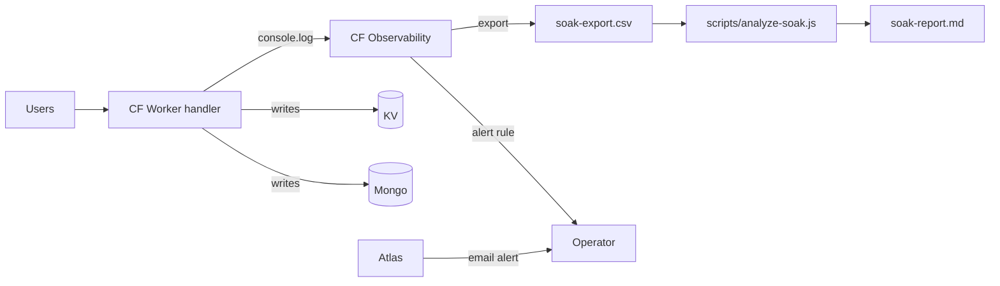

# Phase 06 — Staged Deploy + Soak (Cold-Start Gate)

## Context Links
- [Driver report](../reports/researcher-260425-1924-mongodb-atlas-fit-and-driver.md) §"Cold-Start Cost" (~1500ms baseline)
- [Validation matrix](../reports/researcher-260425-1934-free-db-validation-matrix.md) — Atlas rejected on cold-start grounds; this phase validates user's bet
- [Brainstormer Findings #4, #8, #10](../reports/brainstormer-260425-2034-atlas-plan-critique.md)
- [Code-reviewer #10, #11](../reports/code-reviewer-260425-2034-atlas-plan-correctness.md)
- [Debugger GAP-A, GAP-B, #2, #13, Q4](../reports/debugger-260425-2034-atlas-plan-failure-modes.md)
- Phase 01 — `BASELINE_COLD_PING_MS` recorded; this phase derives the abort gate from it
- `src/bot.js` `getBot()` — memoization model (warm path comparison)

## Overview
- **Priority:** P0 (DECISION GATE)
- **Status:** pending
- **Description:** Deploy with dual-write live, observe cold-start latency for 24h (extend to 72h only on stop-condition), decide whether to cutover or pivot to Upstash. **This phase contains the hard abort criteria.** Telemetry deployed in Phase 04 is exercised here; no new code paths added except a synthetic burst test pre-deploy.

## Key Insights
- Dual-write means latency = `max(KV, Mongo)` per write. KV ~5ms; Mongo cold ~1500ms; Mongo warm ~50ms. Net effect: write p99 jumps to ~1500ms during cold isolates.
- CF Workers spawn new isolates on traffic patterns nobody fully predicts. Cannot guarantee warmth.
- User experience proxy: time from `/wordle` keystroke to bot reply. Composed of: Telegram→CF (~50–200ms) + Worker boot + Mongo read + handler logic + reply. **Mongo cold-start is the dominant chunk.**
- M0 connection cap = 500. Each cold isolate opens a new client. Pre-deploy synthetic burst test (debugger #2) verifies headroom before live traffic.
- **Abort gate is derived from Phase-01 baseline** (brainstormer #4): `2.5 × P95(BASELINE_COLD_PING_MS)`. Not asserted at 3000ms.
- **Soak duration = 24h default** (brainstormer #8). Extend to 72h ONLY when stop-condition triggers (see Success/Abort).
- **Automated alerts** (debugger GAP-B): Atlas free-tier email alert + CF Observability rule. 5-min config, zero code.
- **e2e test already lands in Phase 04** (brainstormer #10) — dual-write code is end-to-end validated before this phase deploys.

## Requirements

### Functional
- Deploy at start of low-traffic window (UTC 18:00 / local 01:00 VN).
- Live config: `STORAGE_PRIMARY=kv`, `DUAL_WRITE=1`, `MONGODB_URI` set.
- Telemetry collected (instrumentation lands in Phase 04 or earliest deploy of dual-write — NOT in this phase): per-request timing for `/wordle`, `/loldle`, `/trading`. Bucketed cold (first request in isolate) vs warm.
- Telemetry source: `console.log({ts, cmd, isolate_age_ms, mongo_op_ms, total_ms, cold})` parsed from CF Logs.
- **Soak window:** default 24h (covers daily cron cycle). Extend to 72h only if {cold-start P95 between 2500ms and the derived gate, error rate >0.5%, traffic <50 req/24h}. (brainstormer #8)
- Daily verifier run via `npm run verify:mongo` (manual invocation, captured to `soak-day-N.md`).
- **Synthetic burst test pre-deploy** (debugger #2): hit Worker with 20 parallel cold requests, observe Atlas connection counter, abort if >60% of 500 cap.
- **Automated alerts** (debugger GAP-B):
  - Atlas free-tier email alert: cluster unavailability + connections > 400 (already configured in Phase 01 step 4 — verify still active).
  - CF Observability rule: >10 errors in 1 minute → email.

### Non-functional
- No new code paths added in this phase. Telemetry helper (`src/util/timing.js`) lands with Phase 04 dual-write deploy so from-first-request data exists (debugger #3).
- Dashboards: CF Observability built-in views are sufficient; no external service.
- Telemetry overhead: `console.log` per request — already captured by CF Observability sampling.

## Architecture

### Telemetry helper (lands in Phase 04; SHOWN here for reference — verify against snippet bug, code-reviewer #10)
```js
// src/util/timing.js
export function startTiming(env, cmd) {
  const t0 = Date.now();
  const marks = [];                                      // <-- declared at top (was missing; copy-paste-into-prod risk)
  return {
    mark(label) { marks.push({ label, dt: Date.now() - t0 }); },
    end(extra = {}) {
      const total = Date.now() - t0;
      console.log(JSON.stringify({ event: "cmd_timing", cmd, total, ...extra, marks }));
    }
  };
}
```

### Cold-start tracking (code-reviewer #11)
**Use a module-scoped boolean — NOT `isolate_age_ms < 200ms` (which always misses real cold paths because Mongo connect is 1500ms).** `isolate_age_ms` remains useful as a histogram metric.

```js
// src/index.js — sketch
let isFirstRequestInIsolate = true;
const ISOLATE_BORN = Date.now();
// inside dispatcher:
const isCold = isFirstRequestInIsolate;
isFirstRequestInIsolate = false;
const isolate_age_ms = Date.now() - ISOLATE_BORN;       // metric, not classifier
console.log({ event: "request", cmd, cold: isCold, isolate_age_ms, total_ms });
```

### Soak data flow


## Related Code Files

### CREATE
- `/config/workspace/tiennm99/miti99bot/scripts/analyze-soak.js` — parse CF logs export → p50/p95/p99 per cmd × cold/warm

### MODIFY
- (telemetry helpers + ISOLATE_BORN landed in Phase 04 — no source-code edits in Phase 06)

### DELETE
- (none)

## Implementation Steps
1. Verify Phase 04 telemetry is live in current deploy. Tail logs for 5 min, confirm `cmd_timing` events emitted with `cold` boolean.
2. **Synthetic burst test** (debugger #2): from a local node script or a single test session, fire 20 parallel `/wordle` requests with cache-busting tokens against the deployed Worker. Observe Atlas connection counter in Atlas UI for the next 60s. **Abort if peak > 300 (60% of 500 cap).**
3. Verify CF Observability alert rule active: ">10 errors in 1 min → email" (debugger GAP-B). Verify Atlas email alert (cluster unavailable + connections > 400) active.
4. **Hour 0–1**: synthetic load test. Trigger 50 cold-start cycles (10+ min spacing OR `wrangler tail` confirming fresh isolate). Record p50/p95/p99 cold-start latency.
5. **Hour 1–24**: passive soak. Observe real traffic. Daily snapshot: `npm run verify:mongo` → save report.
6. **Hour 24**: run `scripts/analyze-soak.js`. Pull 24h CF Logs export. Compute:
   - cold-start P50, P95, P99 per command
   - warm P50, P95, P99
   - dual-write divergence count (search log for `dual-write:secondary:failed`)
   - Mongo connection error count
   - **CPU-time errors** (debugger GAP-A) — search for "Worker exceeded CPU time" in CF logs.
7. Decision gate (see Success / Abort below).
8. **Cron behavior note** (debugger Q4): during dual-write window, cron handlers receive whichever store the env flag selects. Cron writes during `STORAGE_PRIMARY=kv` go to KV; Mongo's `trading_trades` won't have retention-enforced trims until cutover. Document in `soak-decision.md`. Manual cleanup post-cutover: run `trading-retention` once with Mongo as primary to trim Mongo-side accumulated rows.
9. If proceeding: continue soak ONLY IF stop-condition triggers extension to 72h, then go to Phase 07.
10. If aborting: see Pivot Path (now linked to phase-07-alt-pivot.md).

## Todo List
- [ ] Phase 04 telemetry confirmed live (cmd_timing events with `cold` boolean)
- [ ] Phase 04 e2e storage-roundtrip test passing on current build
- [ ] **Synthetic burst test** completed; Atlas connection peak ≤ 300/500
- [ ] CF Observability alert rule (>10 errors / min → email) active
- [ ] Atlas email alert (unavailable + connections > 400) verified
- [ ] Hour-1 synthetic cold-start measurement complete
- [ ] Hour-24 passive soak analyzed
- [ ] `scripts/analyze-soak.js` produced p50/p95/p99 buckets
- [ ] No CPU-time errors in CF logs (debugger GAP-A)
- [ ] Daily `verify:mongo` runs (≥1 in 24h soak; ≥3 if extended to 72h) all PASS
- [ ] Decision recorded in `soak-decision.md`: PROCEED or ABORT (24h or 72h reason cited)
- [ ] If ABORT: execute [phase-07-alt-pivot.md](phase-07-alt-pivot.md)

## Success Criteria (PROCEED to Phase 07)
- Cold-start P95 for `/wordle` and `/loldle` ≤ **`2.5 × BASELINE_COLD_PING_MS`** (derived from Phase-01 step 13; e.g., baseline 1500ms → gate 3750ms).
- Warm P95 ≤ 500ms.
- Dual-write secondary failure rate < 0.1% over 24h.
- M0 connection peak ≤ 400 of 500 cap.
- Zero CPU-time exceeded errors in CF logs.
- 1 (24h) or 3 (72h) consecutive `verify:mongo` runs PASS with 0 mismatches.
- No M0 auto-pause incidents.

### Soak duration rule
- **Default 24h** (covers daily cron cycle).
- **Extend to 72h ONLY IF** any of: cold-start P95 between 2500ms and the derived gate, error rate >0.5%, traffic <50 req/24h. (brainstormer #8)
- Document the chosen duration + reason in `soak-decision.md`.

## Abort Criteria (PIVOT to Upstash, do NOT retry)
Any ONE of:
- Cold-start P95 > derived gate over the soak window.
- Dual-write divergence rate > 1% sustained for >1h.
- Connection saturation event (>400/500 connections seen).
- M0 auto-pause occurs unexpectedly during soak.
- Atlas outage > 5min during soak.
- Verifier reports >0.5% data drift on any module.
- **Worker CPU-time exceeded errors** observed (debugger GAP-A).

### Pivot Path (if aborted)
1. Set `STORAGE_PRIMARY=kv`, `DUAL_WRITE=0` → redeploy. Bot returns to KV/D1 only.
2. Leave Mongo cluster + collections in place for forensic analysis (24h, then take a `mongoexport` snapshot).
3. Execute [phase-07-alt-pivot.md](phase-07-alt-pivot.md) — pre-written Upstash skeleton.
4. Decommission Atlas only after Upstash live and stable for 7 days.

## Risk Assessment

| Risk | Likelihood | Impact | Mitigation |
|------|-----------|--------|------------|
| Cold-start > derived gate under real traffic | M (research says probable) | H | Pivot path documented above + pre-written. No retries on Atlas; the limit is architectural. |
| Dual-write doubles end-to-end p99 even when warm | H | M | `Promise.allSettled` parallelism keeps warm penalty small (~50ms). p99 dominated by Mongo cold; expected. |
| CF Observability log volume exceeds 200k events/day cap | L | M | Sampling already at 1.0 in `wrangler.toml`; can drop to 0.1 if hit. |
| Soak window misses peak traffic (weekend pattern) | M | M | Stop-condition extends to 72h when traffic <50 req/24h or borderline cold-start. |
| Operator misreads verifier "PASS within 1%" as exact match | L | M | analyze-soak.js prints exact diff numbers. |
| Mongo cluster wakes mid-soak triggering 30s+ delay | L | H | Detect via timing logs + Atlas alert; treat as auto-pause incident → ABORT. |
| Instrumentation itself adds latency | L | L | `console.log` in CF is async + cheap; <1ms. |
| `analyze-soak.js` parser breaks on log format changes | L | L | Pin format; tests on synthetic CSV. |
| Burst test triggers M0 cap before live deploy | M | M | Step 2 abort condition prevents proceeding if peak > 300/500. |
| Cron-during-soak writes go to wrong primary | M | L | Documented in step 8; manual cleanup post-cutover. |

## Security Considerations
- Telemetry logs: never log message content, user_id raw, command arguments. Only `cmd` (e.g. `/wordle`), durations, isolate age, cold flag.
- `analyze-soak.js` runs locally; CSV export has no secrets but may contain user IDs — handle as PII.

## Rollback (this phase only)
- Set `DUAL_WRITE=0` → redeploy. Mongo writes stop. Telemetry remains (cheap, useful diagnostic).
- Telemetry can be disabled by deleting `startTiming` calls; not required.

## Next Steps
- **Blocks:** Phase 07 cutover.
- **Unblocks:** Phase 07 (if PROCEED) OR phase-07-alt-pivot (if ABORT).
- **Decision artifact:** `plans/260425-1945-mongodb-atlas-migration/soak-decision.md` (created during this phase).
