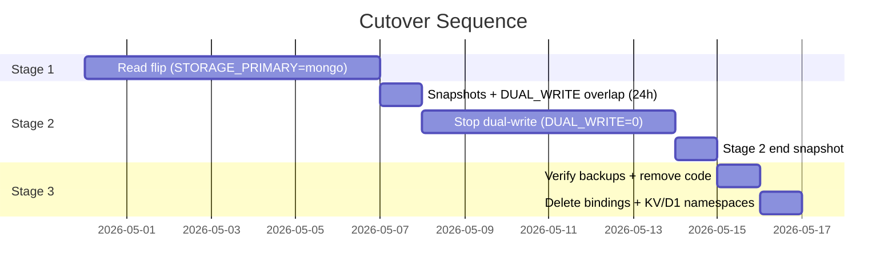
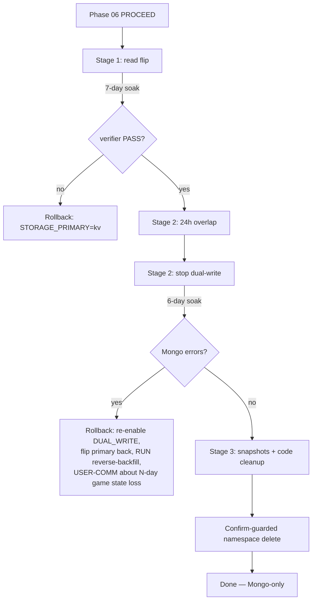

# Phase 07 — Cutover + Decommission

## Context Links
- [Schema report](../reports/researcher-260425-1924-mongodb-schema-and-migration.md) §5 Phase 5–6 (cutover + decommission)
- [Code-reviewer #4, #9, #12](../reports/code-reviewer-260425-2034-atlas-plan-correctness.md)
- [Debugger #12, #14](../reports/debugger-260425-2034-atlas-plan-failure-modes.md)
- `wrangler.toml:14-22` — KV + D1 bindings to remove
- Phase 04 — flag matrix (this phase flips primary)
- Phase 06 — soak decision must be PROCEED before this phase starts
- Phase 07-ALT — fallback if soak ABORTed

## Overview
- **Priority:** P0 (irreversible after step 18)
- **Status:** pending (blocked on Phase 06 PROCEED)
- **Description:** Flip read primary to Mongo, soak Mongo-primary, then disable secondary writes, then delete CF KV + D1 bindings + dependent code. **First reversible step** (flag flip) and **first irreversible step** (binding deletion) clearly demarcated.

## Key Insights
- Cutover is a **two-stage** flip:
  1. **Read flip** (reversible): `STORAGE_PRIMARY=mongo`, `DUAL_WRITE=1`. Reads now from Mongo, writes still to both. **Rollback = flip flag back.**
  2. **Write decommission**: `DUAL_WRITE=0` AFTER 24h Stage-2 dual-write overlap (code-reviewer #9). Writes to Mongo only. KV/D1 frozen.
  3. **Binding deletion** (irreversible): `wrangler kv namespace delete`, `wrangler d1 delete`. Data gone.
- **Dual-write overlap** (code-reviewer #9): keep `DUAL_WRITE=1` for the FIRST 24h of Stage 2; only flip to `DUAL_WRITE=0` after 24h of Mongo-primary stability. Reduces single-region M0 data-loss exposure.
- **Atlas snapshot at start AND end of Stage 2** (code-reviewer #9): `wrangler d1 export miti99bot-db --remote --output=...` once at Stage-2 start (KV/D1 baseline) and `mongoexport` at end. Local-disk checkpoints, not committed.
- 7-day cooldown between each stage. Catch slow-burn issues.
- `register.js` stub setup from Phase 04 already handles Mongo absence — no changes needed at deploy time.
- Trading module D1 tables are gone post-decommission. The D1 binding in `wrangler.toml` must be removed; `createSqlStore` already returns null when `env.DB` absent — safe.
- **`package.json` deploy chain** (code-reviewer #12): MUST remove `&& npm run db:migrate` from `deploy` script AND remove the `db:migrate` script entry. Otherwise next deploy ENOENTs on `scripts/migrate.js`.
- **Reverse-backfill scripts pre-built** (code-reviewer #4): `scripts/backfill-mongo-to-kv.js` + `scripts/backfill-mongo-to-d1.js` written BEFORE Stage 2, tested against fakes. Otherwise rollback under outage pressure → guaranteed data loss.
- **Stage-2 rollback = N-day game state loss** (debugger #14): explicit user-comm note. Operator informs users before executing rollback.
- **Irreversible-step guard** (debugger #12): wrap `wrangler kv namespace delete` + `wrangler d1 delete` in a tiny shell function requiring typed `CONFIRM`. Document: never run in CI.

## Requirements

### Functional
- **Stage 1 (Read flip)**: deploy with `STORAGE_PRIMARY=mongo`, `DUAL_WRITE=1`. Soak 7 days. Daily `verify:mongo` runs. Reverse-backfill scripts pre-built before this stage.
- **Stage 2 (Stop dual-write)**:
  - Stage-2 day 0: take D1 export snapshot + run `mongoexport` snapshot (start baseline).
  - Stage-2 day 0–1: deploy with `DUAL_WRITE=1` still on (24h overlap; code-reviewer #9).
  - Stage-2 day 1: set `DUAL_WRITE=0`. Deploy. Soak remaining 6 days.
  - Stage-2 day 7: `mongoexport` end snapshot.
- **Stage 3 (Final cleanup, irreversible)**:
  - Verify both Stage-2 snapshots committed to local-disk backups (no commit).
  - Delete dependent code: `cf-kv-store.js`, `cf-sql-store.js`, `dual-kv-store.js`, `dual-sql-store.js`, drift-verifier cron.
  - Refactor tests off `fake-d1.js`; delete `fake-d1.js`.
  - Remove KV + D1 bindings from `wrangler.toml`.
  - **Edit `package.json`** (code-reviewer #12): remove `&& npm run db:migrate` from `deploy` chain; remove `db:migrate` script entry.
  - Delete `scripts/migrate.js`.
  - Wrap KV/D1 namespace deletes in confirm-guard (debugger #12).
  - `wrangler kv namespace delete --namespace-id <id>`.
  - `wrangler d1 delete miti99bot-db`.
- Update `src/db/create-store.js` to remove KV branch. Become Mongo-only (no flag).
- Update `src/db/create-sql-store.js` similarly.

### Non-functional
- Each stage has a single-line summary in `cutover-log.md`.
- Backup files committed only as references in plan dir (NOT raw data — privacy).
- Bindings removed from `wrangler.toml` in same commit that removes the dependent code.

## Architecture





## Related Code Files

### CREATE (BEFORE Stage 2 — code-reviewer #4)
- `/config/workspace/tiennm99/miti99bot/scripts/backfill-mongo-to-kv.js` — reverse-backfill script for emergency rollback.
- `/config/workspace/tiennm99/miti99bot/scripts/backfill-mongo-to-d1.js` — same for trading.
- `/config/workspace/tiennm99/miti99bot/scripts/wrangler-delete-guard.sh` — wraps `wrangler kv namespace delete` / `wrangler d1 delete` in `read -p CONFIRM` prompt (debugger #12).
- `/config/workspace/tiennm99/miti99bot/plans/260425-1945-mongodb-atlas-migration/cutover-log.md` — running log of stages, dates, observations.

### MODIFY
- `/config/workspace/tiennm99/miti99bot/wrangler.toml` — Stage 1: change `STORAGE_PRIMARY = "mongo"`. Stage 2 day 1: `DUAL_WRITE = "0"`. Stage 3: remove `[[kv_namespaces]]`, `[[d1_databases]]`, drop `STORAGE_PRIMARY`/`DUAL_WRITE`/`DRIFT_SAMPLE_N`/drift-verifier cron.
- `/config/workspace/tiennm99/miti99bot/src/db/create-store.js` — Stage 3: remove KV branch, simplify to Mongo-only (matches the post-cutover shape pre-designed in Phase 04).
- `/config/workspace/tiennm99/miti99bot/src/db/create-sql-store.js` — Stage 3: same.
- `/config/workspace/tiennm99/miti99bot/scripts/register.js` — Stage 3: replace `stubKv`/`stubMongo` shims with single Mongo stub OR skip Mongo entirely.
- `/config/workspace/tiennm99/miti99bot/scripts/stub-kv.js` — Stage 3: rename to `stub-bindings.js`, drop KV/AI-only stubs as appropriate.
- `/config/workspace/tiennm99/miti99bot/package.json` — **Stage 3 step 17: remove `&& npm run db:migrate` from `deploy` chain AND remove the `db:migrate` script entry** (code-reviewer #12).

### DELETE (Stage 3 only)
- `/config/workspace/tiennm99/miti99bot/src/db/cf-kv-store.js`
- `/config/workspace/tiennm99/miti99bot/src/db/cf-sql-store.js`
- `/config/workspace/tiennm99/miti99bot/src/db/dual-kv-store.js`
- `/config/workspace/tiennm99/miti99bot/src/db/dual-sql-store.js`
- `/config/workspace/tiennm99/miti99bot/src/cron/drift-verifier.js`
- `/config/workspace/tiennm99/miti99bot/scripts/backfill-kv-to-mongo.js`
- `/config/workspace/tiennm99/miti99bot/scripts/backfill-d1-to-mongo.js`
- `/config/workspace/tiennm99/miti99bot/scripts/verify-mongo-parity.js` (or move to `archive/`)
- `/config/workspace/tiennm99/miti99bot/scripts/analyze-soak.js`
- `/config/workspace/tiennm99/miti99bot/scripts/migrate.js`
- `/config/workspace/tiennm99/miti99bot/tests/fakes/fake-d1.js`
- `/config/workspace/tiennm99/miti99bot/tests/db/dual-kv-store.test.js`
- `/config/workspace/tiennm99/miti99bot/tests/db/dual-sql-store.test.js`
- `/config/workspace/tiennm99/miti99bot/src/modules/trading/migrations/` (D1 migrations no longer relevant)
- `/config/workspace/tiennm99/miti99bot/scripts/backfill-mongo-to-kv.js` (reverse-backfill no longer needed post-cutover)
- `/config/workspace/tiennm99/miti99bot/scripts/backfill-mongo-to-d1.js`

## Implementation Steps

### Pre-Stage 2 Prerequisites (CODE-REVIEWER #4)
0a. Pre-build `scripts/backfill-mongo-to-kv.js` (sketch: enumerate Mongo collection → for each `{_id, value, expiresAt}`, write back to CF KV via REST API + `expirationTtl`). Test against `fake-mongo` + a tiny REST-API mock.
0b. Pre-build `scripts/backfill-mongo-to-d1.js` (enumerate `trading_trades` → use `legacy_id` if present, else generate sequential int → emit SQL `INSERT INTO trading_trades` → pipe through `wrangler d1 execute --remote --file`). Test against fakes.

### Stage 1 — Read flip (reversible)
1. Verify Phase 06 PROCEED decision recorded.
2. Set `STORAGE_PRIMARY = "mongo"` in `wrangler.toml`.
3. `npm run deploy`.
4. Smoke: send `/wordle` from a test chat. Confirm reply.
5. Tail logs: confirm reads now hit Mongo (`mongo_op_ms` field populated).
6. Soak 7 days. Daily `verify:mongo`.
7. **Rollback**: revert flag, redeploy. KV still has writes (dual-write still on).

### Stage 2 — Snapshots + 24h overlap → stop dual-write (reversible until KV deleted)
8. **Stage-2 day 0**: take baseline snapshots (code-reviewer #9):
   - `npx wrangler d1 export miti99bot-db --remote --output=./.backups/d1-stage2-start.sql`
   - `mongoexport --uri "$MONGODB_URI" --collection trading_trades --out=./.backups/mongo-trades-stage2-start.json` (and per-KV-collection for completeness)
9. Deploy with `DUAL_WRITE=1` still on. Run 24h overlap window. Verify dual-write health (no new divergence).
10. **Stage-2 day 1**: set `DUAL_WRITE = "0"` in `wrangler.toml`. Deploy. Smoke. Soak 6 more days.
11. **Stage-2 day 7**: `mongoexport ... --out=./.backups/mongo-trades-stage2-end.json`.
12. **Rollback** (irreversible until KV deletion is the next stage; rollback = real work):
    - Re-enable `DUAL_WRITE=1`, flip `STORAGE_PRIMARY=kv`. Redeploy.
    - Run `node scripts/backfill-mongo-to-kv.js && node scripts/backfill-mongo-to-d1.js` to recover Mongo-only writes back into KV/D1.
    - **Inform users that game state for the last N days is reverting** (debugger #14).

### Stage 3 — Backup + delete bindings (IRREVERSIBLE after step 18)
13. Verify Stage-2 backup files exist on operator local disk.
14. Refactor any test still using `fake-d1.js` to `fake-mongo.js`. Then delete `fake-d1.js`.
15. Simplify `create-store.js` and `create-sql-store.js` to Mongo-only (matches Phase-04 pre-designed shape). Delete dual-store files + drift-verifier cron + reverse-backfill scripts.
16. Delete `cf-kv-store.js` + `cf-sql-store.js`.
17. **Edit `package.json`** (code-reviewer #12):
    - Remove `&& npm run db:migrate` from `deploy` script.
    - Remove the `db:migrate` script entry.
    - **Verify `npm run deploy` parses + runs to dry-run completion BEFORE step 18.**
18. Remove `[[kv_namespaces]]` + `[[d1_databases]]` from `wrangler.toml`. Remove `STORAGE_PRIMARY` + `DUAL_WRITE` + `DRIFT_SAMPLE_N` vars + drift-verifier cron entry.
19. **IRREVERSIBLE** (debugger #12; never run in CI):
    ```sh
    bash scripts/wrangler-delete-guard.sh kv f7f190fcb2fa42eb84a05542911334b0
    bash scripts/wrangler-delete-guard.sh d1 miti99bot-db
    ```
    Each script prompts `Type CONFIRM to delete:` before invoking the destructive wrangler command.
20. Delete `scripts/migrate.js`, `scripts/backfill-*.js`, `scripts/verify-mongo-parity.js`, `scripts/analyze-soak.js`, `scripts/wrangler-delete-guard.sh`, trading D1 migrations folder.
21. `npm run lint`, `npm test`, `npm run deploy`. All green.
22. Update `cutover-log.md` with completion timestamp.

## Todo List
- [ ] **Pre-Stage 2: `scripts/backfill-mongo-to-kv.js` + `scripts/backfill-mongo-to-d1.js` written + tested against fakes**
- [ ] Stage-1 deployed (`STORAGE_PRIMARY=mongo`)
- [ ] Stage-1 soak 7 days, verifier PASS daily
- [ ] **Stage-2 day-0 baseline snapshots** (D1 export + mongoexport)
- [ ] Stage-2 24h dual-write overlap completed
- [ ] Stage-2 `DUAL_WRITE=0` deployed
- [ ] Stage-2 6-day soak, no Mongo errors
- [ ] **Stage-2 end-of-window mongoexport** snapshot
- [ ] Stage-3 backups verified on local disk
- [ ] Tests refactored off `fake-d1`
- [ ] `create-store.js` simplified
- [ ] `create-sql-store.js` simplified
- [ ] Dual stores + drift-verifier + reverse-backfill scripts deleted
- [ ] CFKVStore + CFSqlStore deleted
- [ ] **`package.json` `deploy` chain edited (no `db:migrate`); `db:migrate` script removed; dry-run deploy passes**
- [ ] `wrangler.toml` bindings removed
- [ ] `scripts/wrangler-delete-guard.sh` written + manually verified to prompt
- [ ] KV namespace deleted via guarded script
- [ ] D1 database deleted via guarded script
- [ ] `migrate.js` deleted
- [ ] Final deploy passes; bot operational on Mongo-only

## Success Criteria
- Bot serves all 13 modules from Mongo only. No KV or D1 reads anywhere in code.
- `wrangler.toml` has no KV or D1 bindings.
- `package.json` `deploy` script no longer references `db:migrate`.
- `npm test` passes with no `fake-d1` references.
- Mongo collections exhibit expected sizes (compared against pre-cutover backups).
- `cutover-log.md` documents each stage with timestamp + verifier result.

## Risk Assessment

| Risk | Likelihood | Impact | Mitigation |
|------|-----------|--------|------------|
| Stage 1 flip surfaces hidden read-path bug not caught in dual-write | M | H | Smoke test in 5 commands first; tail logs for 1h before declaring stable. Rollback flag. |
| Stage 2 surfaces write-path bug (KV was masking Mongo write failure) | M | H | 24h overlap window catches early. Phase 04 logged secondary failures; review log diff. |
| Single-region M0 data loss during Stage 2 soak | L | H | Snapshots at start AND end of Stage 2 (code-reviewer #9). 24h overlap reduces single-source window. |
| Operator forgets to back up before binding delete | L | CRITICAL | Step 13 gates step 19; require Stage-2 snapshot files on disk. |
| Wrangler CLI namespace-delete accidentally runs in CI | L | CATASTROPHIC | `scripts/wrangler-delete-guard.sh` requires typed CONFIRM (debugger #12). Documented: never in CI. |
| Tests still importing `fake-d1` break after delete | L | M | Step 14 grep `fake-d1` and refactor before step 19. |
| Mongo collection accidentally dropped during cleanup | L | CRITICAL | No `db.dropCollection` in any script. Operator-only commands. |
| Atlas auto-pause triggers post-cutover during low traffic | L | M | Bot has 6+ daily crons that write Mongo post-cutover. Phase 08 verifies. |
| `register.js` breaks because stubKv removed | L | M | Step 15 includes register stub refactor; `npm run register:dry` is a release gate. |
| `npm run deploy` breaks on `db:migrate` ENOENT | M | H | **Step 17 fixes package.json BEFORE step 19 namespace delete** (code-reviewer #12). |
| Stage-2 rollback reverses N days of Mongo-only writes | guaranteed if rollback | H | Reverse-backfill scripts pre-built; user-comm note required (debugger #14). |

## Security Considerations
- Backup files contain user IDs — store on encrypted disk; do NOT commit.
- After binding deletion, the only path to historical data is the local backup file.
- Connection string + DB user remain; rotate password at Stage 3 step 21 to invalidate any leaked-during-migration creds.

## Rollback

| Stage | Reversible? | Action |
|-------|-------------|--------|
| Stage 1 | YES | Flip `STORAGE_PRIMARY=kv`, redeploy. Latency: <2 min. |
| Stage 2 day 0–1 (overlap) | YES | Flip `STORAGE_PRIMARY=kv` while DUAL_WRITE still on. KV is fresh. |
| Stage 2 day 1+ (DUAL_WRITE=0) | YES (with stale KV) | Re-enable `DUAL_WRITE=1` + flip primary. **Run reverse-backfill scripts** to recover Mongo-only writes. **User-comm: N-day game state revert.** |
| Stage 3 step 13–18 | YES | Revert commits, redeploy. Bindings still exist. |
| Stage 3 step 19+ | NO | Restore from local backup files into a fresh KV namespace. Manual operator process; expect 4–8h. |

## "If aborting" — link to alternative
If at any stage the operator decides to abandon the migration (cold-start regression discovered, M0 limits hit, etc.), execute [phase-07-alt-pivot.md](phase-07-alt-pivot.md). Reverse-backfill scripts (built in pre-Stage 2) are reusable for the abort path.

## Next Steps
- **Blocks:** Phase 08 (final tests + docs).
- **Unblocks:** Phase 08.
- **Post-completion:** Atlas cluster monitoring becomes routine. Cost guardrail doc due in Phase 08.
