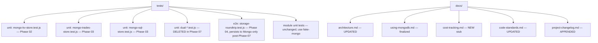

# Phase 08 — Tests + Docs (Trimmed)

## Context Links
- All phases 01–07
- [Brainstormer #9, #10](../reports/brainstormer-260425-2034-atlas-plan-critique.md)
- `docs/architecture.md` § 8 "Swapping the backends"
- `tests/fakes/` — fakes inventory
- `CLAUDE.md` (root) — project conventions to mirror in new docs
- `docs/using-d1.md` — pattern for the new `using-mongodb.md` (Phase 01 began it; this phase finalizes)

## Overview
- **Priority:** P1
- **Status:** pending
- **Description:** Doc-only finalization. Most tests + secret-leak lint + e2e roundtrip already landed in earlier phases (01, 04). This phase verifies CI integration and updates documentation.

## Key Insights
- All unit tests landed alongside their phase (Phases 02, 03, 04, 05).
- **e2e test landed in Phase 04** (brainstormer #10), not here.
- **Secret-leak lint landed in Phase 01** (brainstormer #10), not here. Phase 08 verifies CI runs it + existing files are clean.
- **M0 auto-pause cron heartbeat is NOT an unresolved question** (brainstormer #9): bot has 6+ daily crons; post-cutover any cron that writes data prevents pause. Phase 08 confirms.
- The single biggest doc owe: `docs/using-mongodb.md` — runbook covering provisioning, connection, troubleshooting, auto-pause, password rotation, M0→Flex upgrade. Started in Phase 01; finalized here.
- Cost guardrail: M0 is free, but plan for the day it isn't. Stub doc explaining when to upgrade.
- Test fakes: `fake-mongo.js` may have grown; freeze the surface and document.

## Requirements

### Functional
- **Verify** secret-leak lint runs in CI (`npm run lint` chain) and existing files are clean. (Lint introduced in Phase 01.)
- **Verify** e2e storage-roundtrip test (Phase 04) passes in current CI build.
- **Verify** daily crons write to Mongo post-cutover (brainstormer #9 — replaces unresolved Q). If `misc` daily cron is read-only, add a single `db.runCommand({ping:1})` line to it.
- Doc updates:
  - `docs/using-mongodb.md` — finalized runbook (started Phase 01).
  - `docs/architecture.md` — § 8 updated to describe Mongo-only state, removal of CF KV/D1.
  - `docs/code-standards.md` — add note: "All persistence goes through `MongoKVStore` / `MongoTradesStore`. Modules NEVER touch the Mongo client directly."
  - `docs/cost-tracking.md` (new, stub) — when M0 fills, what triggers upgrade, expected cost ladder (M0 → Flex → M10).
  - `docs/development-roadmap.md` — **verify migration is NOT listed** (per user feedback memory: roadmap = future-only). Remove if present.
  - `docs/project-changelog.md` — append migration entry.
  - `README.md` — update database section.
  - `CLAUDE.md` (root) — update Architecture section: replace KV/D1 references with Mongo.
- Append "Alternatives considered" section to plan.md (already done at plan creation; verify still accurate).

### Non-functional
- New docs ≤200 lines each.
- Tests use existing fakes — no new mocks created in this phase.
- Run final `npm run lint && npm test && npm run register:dry` before sign-off.

## Architecture

## Related Code Files

### CREATE
- `/config/workspace/tiennm99/miti99bot/docs/cost-tracking.md` (stub)

### MODIFY
- `/config/workspace/tiennm99/miti99bot/docs/architecture.md` — § 8 + any KV/D1 reference
- `/config/workspace/tiennm99/miti99bot/docs/using-mongodb.md` — finalize from Phase-01 partial
- `/config/workspace/tiennm99/miti99bot/docs/code-standards.md`
- `/config/workspace/tiennm99/miti99bot/docs/project-changelog.md` (append)
- `/config/workspace/tiennm99/miti99bot/docs/development-roadmap.md` (verify migration NOT listed; remove if present)
- `/config/workspace/tiennm99/miti99bot/README.md`
- `/config/workspace/tiennm99/miti99bot/CLAUDE.md` (root) — Architecture section
- `/config/workspace/tiennm99/miti99bot/tests/fakes/fake-mongo.js` — comment block documenting frozen surface
- `/config/workspace/tiennm99/miti99bot/src/modules/misc/index.js` — IF the daily cron does not already write data, add a `db.runCommand({ping:1})` line (brainstormer #9 — replaces unresolved Q)

### DELETE
- (none new in this phase; Phase 07 already removed all CF-specific code)

## Implementation Steps
1. Grep all `docs/` and `README.md` for `KV`, `Cloudflare KV`, `D1`, `CFKVStore`, `CFSqlStore`. Build edit list.
2. Update `docs/architecture.md` § 8: replace "Swap CFKVStore → other backend" narrative with "Mongo is the backend; swap target is `mongo-kv-store.js`". Update §10 unchanged (no admin HTTP surface — Phase 05 complies).
3. Finalize `docs/using-mongodb.md` (started Phase 01):
   - Provisioning steps (Atlas UI walkthrough)
   - Connection string format
   - Auto-pause behavior + how to wake (just send a request)
   - Password rotation procedure (90 days, owner = repo maintainer)
   - Failure modes: connection error, SCRAM auth fail, SRV resolution fail, server-selection timeout (paused M0)
   - Node-API surface inventory (from Phase 01 step 9)
   - Atlas alert config (cluster unavailable + connections > 400)
   - 0.0.0.0/0 IP allowlist permanence + paid CF static-egress upgrade path
   - Baseline cold-ping P95 (Phase 01 step 13)
   - When to upgrade (link to cost-tracking.md)
4. Write `docs/cost-tracking.md` stub:
   - M0 limits (storage 512MB, connections 500, ~100 ops/sec)
   - Triggers to upgrade: storage > 400MB sustained, connection saturation, ops/sec degraded
   - Cost ladder: M0 (free) → Flex ($8–30/mo) → M10 ($57/mo)
   - Monthly review checklist
5. Update `docs/code-standards.md`: add Mongo persistence rule (modules go through `MongoKVStore` / `MongoTradesStore`).
6. Append to `docs/project-changelog.md` with date, summary, plan link.
7. Verify `docs/development-roadmap.md` does NOT list this migration. Remove if present (per user feedback memory: roadmap = future-only).
8. Edit root `CLAUDE.md` Architecture section: replace KV/D1 mentions with Mongo.
9. Edit root `README.md` database section.
10. **Verify daily cron writes Mongo** (brainstormer #9): grep `src/modules/misc/index.js` cron handler for any `db.put`/`tradesStore.insert`/equivalent. If absent, add a single `await db.put("misc:last_cron_ping", String(Date.now()))` line. Document inline.
11. **Verify e2e test passes** (brainstormer #10): `npm test -- tests/e2e/storage-roundtrip.test.js`.
12. **Verify secret-leak lint runs** (brainstormer #10): `npm run lint` — confirm `scripts/check-secret-leaks.js` is in the chain and passes on current source.
13. Run `npm run lint`, `npm test`, `npm run register:dry`. All pass.
14. Final commit message: `feat(db): complete migration to MongoDB Atlas M0`.

## Todo List
- [ ] All `docs/` references to KV/D1 grep-clean
- [ ] `docs/architecture.md` § 8 rewritten
- [ ] `docs/using-mongodb.md` finalized (with all Phase-01 + Phase-07 additions)
- [ ] `docs/cost-tracking.md` stub written
- [ ] `docs/code-standards.md` updated
- [ ] `docs/project-changelog.md` appended
- [ ] `docs/development-roadmap.md` verified migration NOT listed
- [ ] `README.md` database section updated
- [ ] Root `CLAUDE.md` Architecture section updated
- [ ] **Daily cron Mongo-write verified** (brainstormer #9 closes the unresolved Q)
- [ ] e2e storage-roundtrip test passing in CI
- [ ] Secret-leak lint passing in CI
- [ ] `tests/fakes/fake-mongo.js` surface documented in header comment
- [ ] Final `npm run lint && npm test && npm run register:dry` all green

## Success Criteria
- `grep -ri "Cloudflare KV" docs/ src/ README.md` returns zero relevant hits.
- `grep -ri "CFKVStore\|CFSqlStore" .` returns zero hits (in source; git history is fine).
- E2E test passes for both wordle (KV path) and trading (Mongo path) modules.
- Lint catches a deliberately-introduced `console.log(env.MONGODB_URI)` (negative test, then revert).
- Documentation reads coherently end-to-end: README → architecture → using-mongodb → cost-tracking.
- Daily cron confirmed writing Mongo (auto-pause non-issue).

## Risk Assessment

| Risk | Likelihood | Impact | Mitigation |
|------|-----------|--------|------------|
| Doc drift between architecture.md and code reality | M | M | Step 1 grep comprehensive; reviewer verifies against git diff. |
| E2E test passes against fake but fails against real Atlas | L | M | Phase 06 soak validated against real Atlas; e2e here is regression coverage. |
| Lint script false-positives break CI | L | M | Tight regex (Phase 01); add allowlist comments for legitimate references in tests if needed. |
| `cost-tracking.md` becomes stale | H | L | Stub by design; review monthly per `documentation-management.md`. |
| Future contributor adds raw `MongoClient` use bypassing store | M | M | code-standards.md note + lint rule (if feasible) flags `import { MongoClient }` outside `src/db/`. |

## Security Considerations
- `using-mongodb.md` must not include real connection string (only redacted form).
- Cost-tracking doc references billing, not credentials.
- Lint check covers `MONGODB_URI`, `TELEGRAM_BOT_TOKEN`, `TELEGRAM_WEBHOOK_SECRET`, `CLOUDFLARE_API_TOKEN`.

## Rollback
- All edits are doc + tests; revert commits if needed without runtime impact.

## Next Steps
- **Blocks:** none (final phase).
- **Post-completion:** schedule monthly cost-tracking review; confirm Atlas dashboard alerts wired (storage > 400MB, connections > 400 — Phase 01 already configured).

---

## Unresolved Questions (plan-level)

1. **`tests/fakes/fake-mongo.js` TTL semantics** — Phase 02 deferred TTL simulation. Read-time `expiresAt` filter is testable (covered in Phase 02 `Date.now()` mock). Acceptable: assert `expiresAt` field presence; trust real Atlas TTL in soak.
2. **`MongoSqlStore` future query expansion** — Phase 03 replaced dispatcher with direct `MongoTradesStore`. New trading queries = new explicit method, not silent dispatcher break. Closed by direct refactor.
3. **`MONGODB_URI` rotation cadence** — 90 days; owner = repo maintainer; documented in `docs/using-mongodb.md` rotation section. Calendar entry in `docs/cost-tracking.md` review cycle.

## Alternatives considered (reviewer dissent)

Reviewers (see brainstormer + code-reviewer + debugger reports in `plans/reports/`) recommended:
1. **Maintenance-window cutover** (~10 min downtime) instead of dual-write — saves ~6h, removes latency amplification.
2. **Defer trading migration** entirely (D1 free tier handles ~100 writes/day indefinitely).
3. **Single shared `kv` collection** instead of 12 per-module collections.
4. **Pivot to Upstash** before starting (smaller bundle, HTTP-native, no cold-start TLS cost).
5. **`MongoTradesStore` direct refactor** instead of SQL-pattern dispatcher — APPLIED (Phase 03).

User chose to proceed with full Atlas migration to validate cold-start UX firsthand. Reviewer correctness/safety findings have been applied throughout phases 01–08; architectural recommendations 1–4 are documented but not adopted. If the cold-start gate trips, [phase-07-alt-pivot.md](phase-07-alt-pivot.md) executes recommendation 4.
